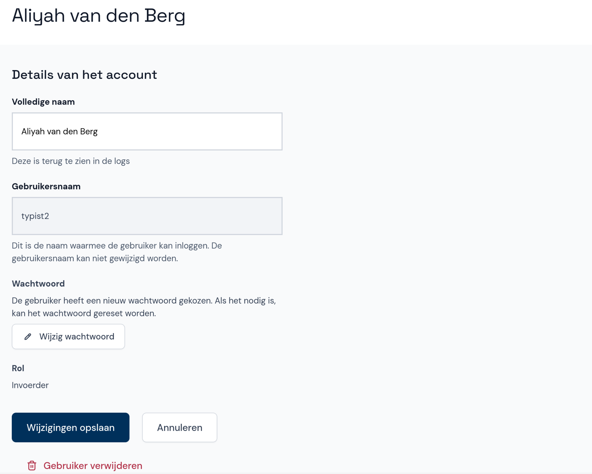

# Gebruiker wijzigen of verwijderen

- Klik onder **Gebruikers beheren** op de gebruiker die je wilt wijzigen.
- Wijzig de volledige naam of reset het wachtwoord. De gebruikersnaam en de rol kunnen niet gewijzigd worden.
- Verwijder de gebruiker door onderaan het scherm op **Gebruiker verwijderen** te klikken.

