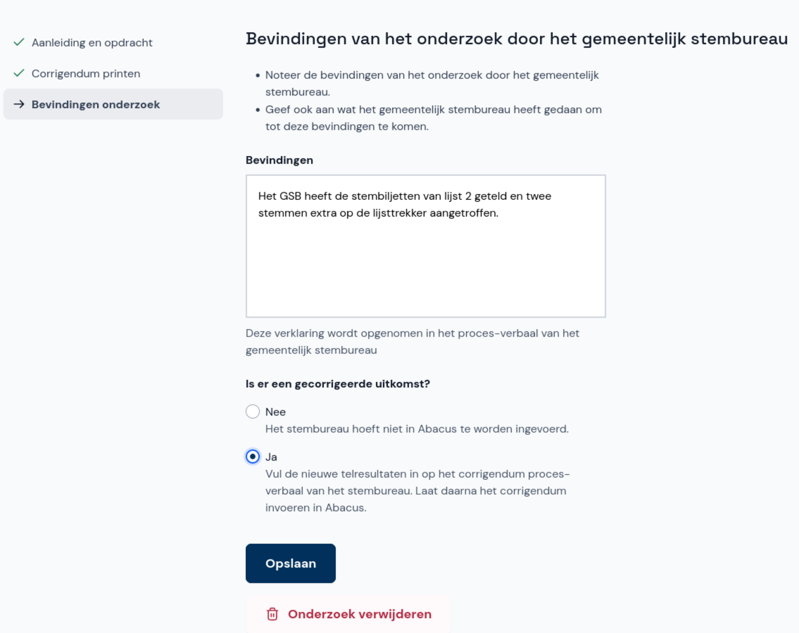

# Bevindingen en invoerfase

- Na het afronden van een onderzoek klik je op **Verder naar bevindingen**. Als je al in het overzicht met onderzoeken bent, klik je daar op **Nu invullen**.
- Klik op **Invoerfase starten** om de invoer van de bevindingen en eventuele telresultaten te starten. Wil je dit nog niet doen, klik dan op **Annuleren**.

- Neem de bevindingen over zoals ze in het corrigendum zijn opgeschreven en klik op **Opslaan**.

In het overzicht van de onderzoeken zie je wat je moet doen en wat de status van elk onderzoek is.

- Is de uitslag niet gecorrigeerd, dan hoef je niets meer te doen.
- Is de uitslag wel gecorrigeerd, dan laat je twee invoerders het corrigendum overnemen in Abacus.

