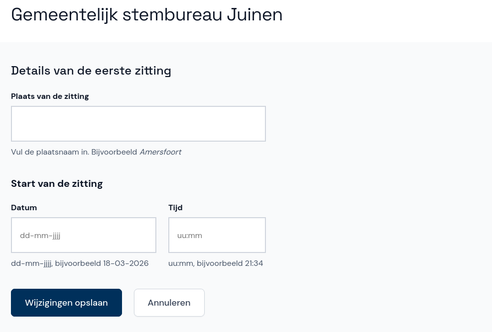

# Details van de zitting

Op dit scherm voer je de plaatsnaam, datum en starttijd van de zitting in. Dit kun je op elk moment tijdens de zitting doen.

- Klik in het overzicht op **Details van de zitting**.
- Vul de plaats, datum en starttijd van de zitting in en klik op **Wijzigingen opslaan**.

Abacus stuurt je automatisch naar dit scherm als deze gegevens nog niet zijn ingevuld wanneer je de zitting afrondt.
