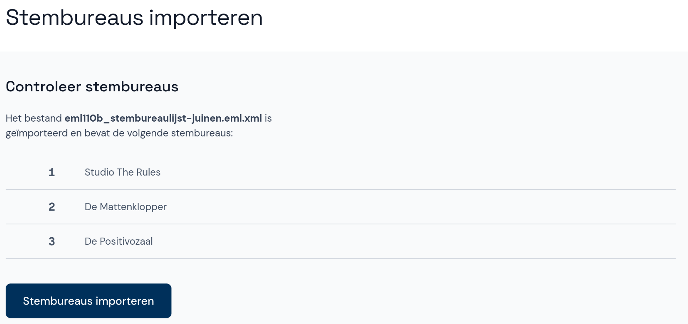

# Stembureaus beheren

Als de beheerder de lijst met stembureaus heeft toegevoegd, is de verkiezing klaar voor steminvoer. Als dit nog niet gebeurd is, heeft de verkiezing de status *Zitting voorbereiden*. De steminvoer kan pas beginnen nadat de stembureaus zijn toegevoegd.

**Let op: Zorg dat de stembureaus in de applicatie overeenkomen met de voor de verkiezingen gepubliceerde lijst. Als er afwijkingen zijn, moeten deze worden opgenomen in het proces-verbaal.**

- Selecteer in de melding **Stembureaus beheren**.

## Lijst met stembureaus importeren

Als je een EML-bestand met stembureaus (EML 110b) hebt, kun je dit direct toevoegen.

**Let op:** Een bestand importeren is niet meer mogelijk als er al stembureaus aanwezig zijn.

- Selecteer **Importeren uit een bestand**.
- Selecteer daarna **Bestand kiezen** en kies het bestand.

- Je ziet nu alle stembureaus die uit het bestand zijn ingelezen.
- Controleer de toegevoegde stembureaus aan de hand van de door de gemeente gepubliceerde lijst en klik op **Stembureaus importeren**.

## Stembureau handmatig toevoegen

Je kunt stembureaus ook handmatig toevoegen om ervoor te zorgen dat de stembureaus in Abacus overeenkomen met de stembureaulijst die voorafgaand aan de verkiezingen is gepubliceerd.

- Als er nog geen stembureaus zijn toegevoegd, klik je in de melding op **Stembureaus beheren**.
- Klik daarna op **+ Handmatig invullen**.

- Als er wel stembureaus zijn, klik je in het hoofdmenu onder de juiste verkiezing op **Stembureaus** om naar het overzicht te gaan.
- Als je al in het voortgangsscherm van de verkiezing bent, kun je daar ook direct op **Stembureaus** klikken.
- Klik op de knop **+ Stembureau toevoegen**.

- Voer de gegevens van het stembureau in en geef aan welke soort stembureau het is.
- Als het aantal kiesgerechtigden van het stembureau bekend is kun je dit invullen, maar dat hoeft niet.
- Klik op **Opslaan en toevoegen**.

## # Stembureau wijzigen of verwijderen

- Klik op het stembureau dat je wilt wijzigen of verwijderen.
- Wijzig het stembureau door de relevante gegevens te veranderen en vervolgens op **Wijzigingen opslaan** te klikken. Klik op **Annuleren** als je de wijzigingen toch niet wilt opslaan.
- Verwijder het stembureau door onderaan het scherm op **Stembureau verwijderen** te klikken.

