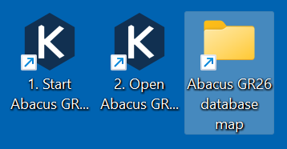

# Methode 1: installatieprogramma downloaden en installeren (Windows)

Met deze methode installeer je Abacus op een Windows-machine.
Deze versie is geschikt om mee te testen. Het is nog niet de definitieve versie van Abacus. Die ontvangen de gemeenten rechtstreeks van de Kiesraad.

- Op de hoofdpagina van de Abacus-repository klik je aan de rechterkant op [Releases](https://github.com/kiesraad/abacus/releases).
- Klik bij de bovenste release op `Assets` en klik vervolgens op het installatiebestand `abacus-windows-setup-[versienummer].exe` om het te downloaden.
- Dubbelklik op het gedownloade bestand om het installatieprogramma te openen. Klik op **Installeren**.

- Tijdens het installatieprogramma wordt Microsoft Visual C++ Redistributable geïnstalleerd en wordt een firewallregel ingesteld via Windows Command Prompt. Daarom zie je tijdens de installatie twee keer een pop-up waarin wordt gevraagd *Wilt u toestaan dat deze app wijzigingen aan uw apparaat aanbrengt?*. Klik in beide gevallen op **Ja**.

- Klik bij de melding *Het toevoegen van de firewallregel is succesvol uitgevoerd* op **OK**.
- Abacus is nu geïnstalleerd. Als je Abacus niet direct wilt starten en de interface niet wilt openen in de browser, zet dan de vinkjes uit. Klik op **Voltooien** om het installatieprogramma te sluiten.

Bij deze installatiemethode worden drie snelkoppelingen op het bureaublad geplaatst:

- Met **1. Start Abacus GR26 server** start je de Abacus-server. Gebruik deze snelkoppeling voordat je Abacus opent in de browser.
- Met **2. Open Abacus GR26 in browser** waarmee je de browserinterface opent.
- Met **Abacus GR26 database map** open je de map met de databasebestanden.

