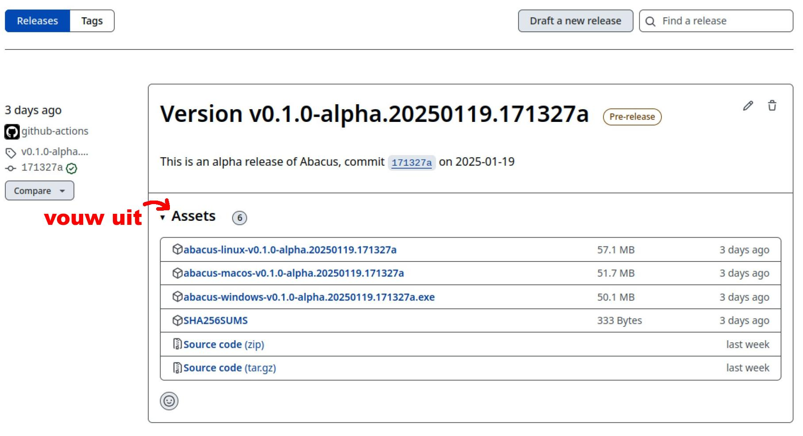

# Abacus uitproberen, installeren en starten

Het uitproberen, installeren en starten van Abacus kan op verschillende manieren. Is Abacus nieuw voor je, begin dan bij de optie 'Uitproberen'. Kom je er met de onderstaande instructies niet uit, neem dan contact op met het team via <abacus@kiesraad.nl>.
Hieronder vind je instructies voor de verschillende methodes.

## Uitproberen

Als je Abacus wilt uitproberen of testen zonder het te installeren, kun je dit doen op <https://abacus-test.nl/>. Hier heb je de volgende opties:

- Maak een nieuwe omgeving aan door bovenaan op `Create new` te klikken. Je kunt kiezen uit de twee meest recente main builds en release builds.
- Als je wilt testen hoe de omgeving werkt na de implementatie van een specifieke pull request, klik dan op `Create new` bij de relevante regel onder **Pull requests**.
- Zoek je naar een bepaalde pull request maar staat die er niet bij, klik dan op `Sync pull requests`. De lijst wordt dan vernieuwd.
- Bestaande omgevingen staan onder **Running services**. Omgevingen die je eerder hebt aangemaakt vind je hier terug en kun je ook stoppen.

Op <https://abacus-test.nl/> is het alleen mogelijk om een testomgeving aan te maken waarin al testgegevens staan. Als je met een lege database wilt beginnen moet je Abacus downloaden en installeren.

## Installeren en starten

Bij de onderstaande installatiemethodes is aangegeven op welke besturingssystemen ze werken. De methoden voor Linux werken op alle gangbare (recente) Linux-distributies en zijn getest op Ubuntu (22.04) en Debian (12/bookworm en 13/trixie). De Windows-methoden zijn getest op Windows 11.

### Methode 1: installatiebestand downloaden en starten (Linux, macOS, Windows)

Deze methode is de snelste manier om Abacus te gebruiken. Voer hiervoor de volgende stappen uit:

Op de hoofdpagina van de Abacus-repository klik je aan de rechterkant op [Releases](https://github.com/kiesraad/abacus/releases). Klik onder de bovenste release op `Assets` en klik vervolgens op het installatiebestand om het te downloaden.



#### Linux en macOS

Open een terminal en maak het bestand uitvoerbaar:

```sh
chmod +x /path/to/binary/abacus-[OS-version]
```

Voer Abacus uit:

```sh
./path/to/binary/abacus-[OS-version] 
```

Zie ook de [help](#help).

#### Windows

Voordat je Abacus kunt gebruiken op Windows heb je eerst het programma Microsoft Visual C++ Redistributable (MSVC Redist) nodig. Dit bestand kun je direct downloaden [op de website van Microsoft](https://learn.microsoft.com/en-us/cpp/windows/latest-supported-vc-redist?view=msvc-170#latest-microsoft-visual-c-redistributable-version). Een directe link vind je hier: [Microsoft Visual C++ Redistributable (MSVC Redist)](https://aka.ms/vs/17/release/vc_redist.x64.exe).

Open een Command Prompt of Powershell en voer Abacus uit. Als je Command Prompt gebruikt, hoef je de `.\` aan het begin niet te typen.

```sh
.\path\to\binary\abacus-windows-[version].exe
```

Zie ook de [help](#help).

Na het starten zie je een popup van Windows Security over de Windows Firewall. Het maakt niet uit wat je hier selecteert, de omgeving werkt altijd. Klik dus gerust op **Cancel (Annuleren)**.

Wanneer Abacus draait, ga je in je browser naar <http://127.0.0.1:8080> om de omgeving te gebruiken.

### Methode 2: handmatig starten (Linux, macOS, Windows)

*Let op: voor deze methode moet je de repository klonen of downloaden.*

Je kunt Abacus ook handmatig starten vanuit de gekloonde repository. Deze optie is bedoeld voor development.

Zorg eerst dat je `npm` en `cargo` hebt geïnstalleerd:

- `npm` is onderdeel van Node.js en dit kun je installeren door de instructies te volgen op de [website van Node.js](https://nodejs.org/en/download/package-manager). Je kunt het beste Node versie 22 downloaden, nieuwere versies worden niet volledig ondersteund.
- `cargo` is onderdeel van Rust en installatie-instructies hiervoor vind je op de [website van Rust](https://www.rust-lang.org/learn/get-started).

Voer eerst in de frontend directory de opdracht `npm ci` uit. Daarna start je `cargo run -features memory-serve,embed-typst --` vanuit de backend-map en `npm run dev` vanuit de frontend-map in twee verschillende terminals.

### Methode 3: Docker Compose (Linux, macOS, Windows)

Hiermee start je de backend in watch mode. Assets worden geserveerd door de build tool `vite` en maken dus gebruik van Hot Module Reloading:

```sh
docker compose up
```

Ook deze optie is bedoeld voor development.

## Starten met lege database

In de map met het installatiebestand maakt Abacus het databasebestand *db.sqlite* aan waarin alle verkiezings- en gebruikersgegevens worden opgeslagen. Gooi dit bestand weg als je deze gegevens wilt verwijderen en Abacus wilt starten met een lege database. Je kunt ook de database resetten door Abacus te starten met het argument `-r` of `--reset-database`.

## Help

Voor meer informatie over de argumenten bekijk je de helpfunctie via de commandline. Op macOS en Linux gebruik je de volgende opdracht:

```sh
./path/to/binary/abacus-[OS-version] --help
```

En op Windows (zonder `.\` in Command Prompt):

```sh
.\path\to\binary\abacus-windows-[version].exe --help
```

## Testdocumenten

In de map [test-pvs-juinen](https://github.com/kiesraad/abacus-documentatie/tree/main/src/testdocumenten/test-pvs-juinen) op GitHub staan de processen-verbaal voor de testgemeente Juinen, waarmee je de testverkiezing kunt invoeren.
Daarnaast staan in de map [test-emls-juinen](https://github.com/kiesraad/abacus-documentatie/tree/main/src/testdocumenten/test-emls-juinen) de EML-bestanden waarmee je deze testverkiezing zelf kunt toevoegen.
