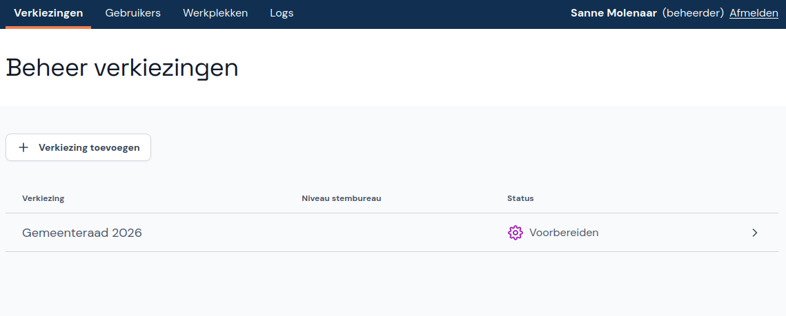
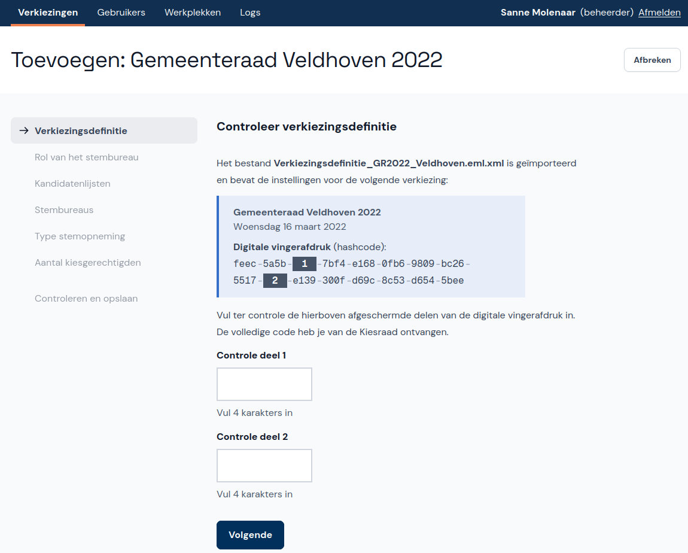
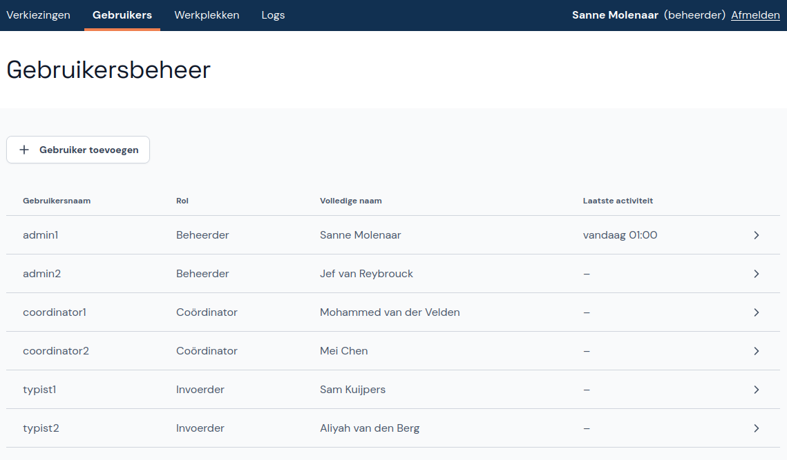
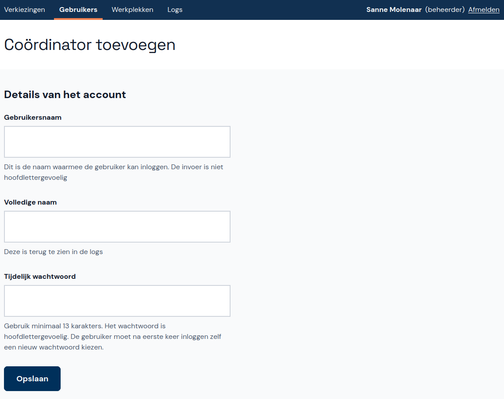
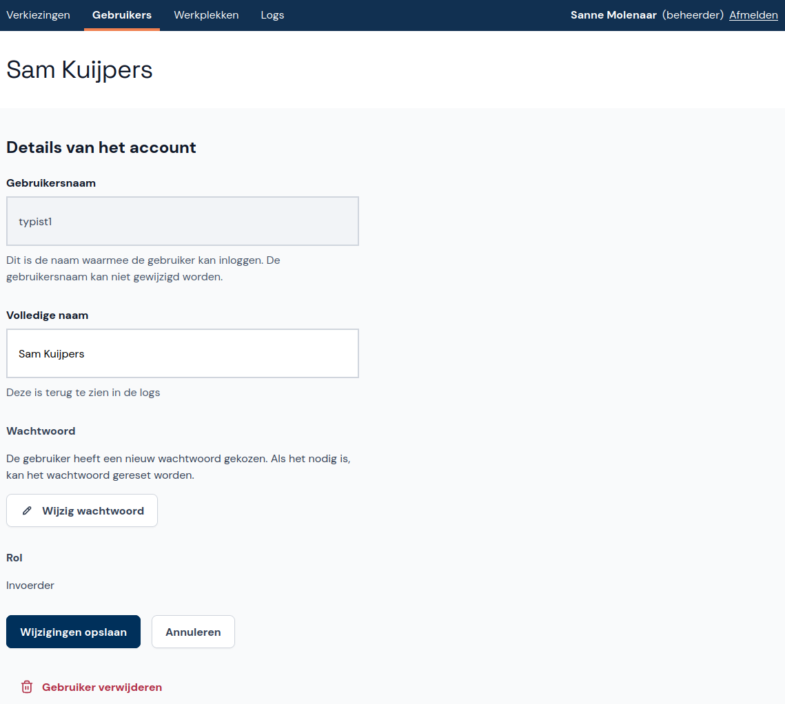

# Abacus - Instructies Beheerder

*Dit document is in ontwikkeling en wordt continu gewijzigd/aangevuld tijdens de ontwikkeling van Abacus.*

Welkom bij Abacus! Deze tool is ontwikkeld om de verkiezingsuitslagen per stembureau in te voeren en te controleren op fouten en afwijkende uitslagen. Na de installatie van Abacus voeg je een verkiezing toe en importeer je stembureaus. Ook maak je gebruikers aan en kun je ze wijzigen als dit nodig is. In dit document leggen we uit hoe je Abacus instelt en gebruikt als beheerder.

**Let op:** sommige adblockers in browsers kunnen een foutmelding in Abacus veroorzaken. Zet adblockers daarom uit of voeg Abacus toe aan de lijst met uitzonderingen in de adblocker.

## Verkiezing toevoegen

Je voegt een verkiezing toe door de bestanden met de verkiezingsdefinitie en de bijbehorende kandidatenlijsten te importeren in Abacus. Download deze bestanden volgens de instructies die je van de Kiesraad hebt gekregen.

- Klik in het hoofdmenu op **Beheer verkiezingen** en vervolgens op **+ Verkiezing toevoegen**.

- Klik op **Bestand kiezen** en kies het bestand met de verkiezingsdefinitie.
- Je ziet nu de digitale vingerafdruk (de hashcode) die bij het bestand hoort, waarvan twee delen zijn afgeschermd. De volledige code heb je van de Kiesraad ontvangen. Voer de ontbrekende delen van de digitale vingerafdruk in.

- Herhaal deze stappen voor het bestand met de kandidatenlijsten en klik dan op **Opslaan**. De verkiezing staat nu in de lijst.

## Stembureaus importeren

*Deze functie is nog in ontwikkeling en wordt later beschreven.*

[comment]: # (Tekst voor wanneer de functie is ontwikkeld: "De verkiezing die je hebt toegevoegd bevat nog geen stembureaus. Je voegt ze toe door een eml-bestand met de lijst van stembureaus te importeren in Abacus. Heeft je gemeente dit bestand niet, dan moet dit eerst aangemaakt worden. In uitzonderlijke situaties kun je stembureaus ook handmatig toevoegen, zie Stembureau toevoegen.")

## Stembureaus beheren

Als beheerder kun je ook handmatig stembureaus toevoegen, wijzigen en verwijderen. Dit doe je alleen in afwijkende situaties. Onder **Beheer verkiezingen** klik je op **Stembureaus**. Als er al stembureaus zijn toegevoegd, zie je die hier staan.

### Stembureau toevoegen

- Klik rechts op de knop **+ Stembureau toevoegen**.

[comment]: # (TODO: Instructies voor batch import toevoegen wanneer de stembureau-importfunctie klaar is, en aangeven dat deze instructies alleen bedoeld zijn voor afwijkende situaties.)

- Voer de gegevens van het stembureau in en geef aan welke soort stembureau het is. Als het aantal kiesgerechtigden van het stembureau bekend is kun je dit invullen, maar dat hoeft niet.
- Klik op **Opslaan en toevoegen**.

### Stembureau wijzigen of verwijderen

- Klik op het stembureau dat je wilt wijzigen of verwijderen.
- Wijzig het stembureau door de relevante gegevens te veranderen en vervolgens op **Wijzigingen opslaan** te klikken. Klik op **Annuleren** als je de wijzigingen toch niet wilt opslaan.
- Verwijder het stembureau door onderaan het scherm op **Stembureau verwijderen** te klikken.

## Gebruikersbeheer

Naast het toevoegen van de verkiezing en stembureaus voeg je ook (andere) beheerders, coördinators en invoerders toe. Hiervoor klik je in het hoofdmenu op **Gebruikersbeheer**.

### Gebruiker toevoegen

- Klik onder **Gebruikersbeheer** op **+ Gebruiker toevoegen**.
- Eerst kies je de rol van de nieuwe gebruiker: Beheerder, Coördinator of Invoerder. Dit kun je later niet meer aanpassen.

- Als de gebruiker een invoerder is, kies je eerst of het account op naam staat of anoniem is. Bij de eerste keer inloggen moeten de gebruikers hun echte naam invoeren. Bij beheerders en coördinators zie je dit scherm niet omdat deze accounts altijd op naam staan.

- Voer de gebruikersnaam, de volledige naam (behalve bij een anonieme invoerder) en een tijdelijk wachtwoord in. Bij de eerste keer inloggen moet de gebruiker het wachtwoord wijzigen.

## Gebruiker wijzigen of verwijderen

- Klik in **Gebruikersbeheer** op de betreffende gebruiker in de lijst.
- Wijzig de volledige naam of reset het wachtwoord. De gebruikersnaam en de rol kunnen niet gewijzigd worden.
- Verwijder de gebruiker door onderaan het scherm op **Gebruiker verwijderen** te klikken.

## Werkplekken beheren

*Deze functie is nog in ontwikkeling en wordt later beschreven.*

## Activiteitenlog

In het activiteitenlog kun je zien welke gebruikers zijn ingelogd en uitgelogd en welke activiteiten ze hebben uitgevoerd. Dit kan handig zijn als je wilt nagaan wat er met een bepaalde invoer gebeurd is.

