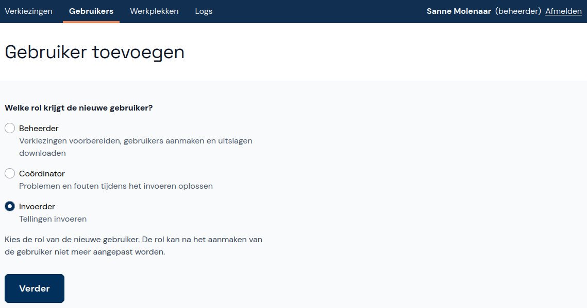

# Abacus - Instructies Beheerder

Welkom bij Abacus! Deze tool is ontwikkeld om de verkiezingsuitslagen per stembureau in te voeren en te controleren op fouten en afwijkende uitslagen. Na de installatie van Abacus voeg je een verkiezing toe en importeer je stembureaus. Ook maak je gebruikers aan en kun je ze wijzigen als dit nodig is. In dit document leggen we uit hoe je Abacus instelt en gebruikt als beheerder.

**Let op:** sommige adblockers in browsers kunnen een foutmelding in Abacus veroorzaken. Zet adblockers daarom uit of voeg Abacus toe aan de lijst met uitzonderingen in de adblocker.

## 1. Account voor beheerder aanmaken

Wanneer je Abacus voor de eerste keer start is de applicatie leeg. Je begint met het aanmaken van een beheerdersaccount:

- Klik eerst op **Account voor beheerder aanmaken** en vul je naam en een gebruikersnaam in.
- Kies een wachtwoord en klik op **Opslaan**. Nu kun je direct inloggen met de aangemaakte gegevens.

Voordat je verdergaat met het toevoegen van een verkiezing kan het handig zijn om eerst een tweede beheerder aan te maken. Kijk hiervoor onder het kopje [Gebruiker toevoegen](#41-gebruiker-toevoegen).

## 2. Verkiezing toevoegen en beheren

Verzamel de gegevens die je nodig hebt om een verkiezing toe te voegen. Zorg dat je de EML-bestanden met de verkiezingsdefinitie (EML 110a) en kandidatenlijsten (EML 230b), de gepubliceerde lijst met stembureaus, het aantal kiesgerechtigden in de gemeente en (optioneel) het EML-bestand met de stembureaus (EML 110b) hebt.

- Als je het account voor de beheerder zojuist hebt aangemaakt, stuurt Abacus je direct naar de juiste pagina om de verkiezing toe te voegen. Als je nog niet op de juiste pagina bent, klik je in het hoofdmenu op **Verkiezingen beheren**.
- Klik onderaan de pagina op **Verkiezing toevoegen**.

### 2.1. Verkiezingsdefinitie

Voeg eerst de verkiezingsdefinitie toe:

- Klik op **Bestand kiezen** en kies het EML-bestand met de verkiezingsdefinitie (EML 110a).
- Je ziet nu de digitale vingerafdruk (de hashcode) die bij het bestand hoort, waarvan twee delen zijn afgeschermd. De volledige digitale vingerafdruk staat in hetzelfde ZIP-bestand als de verkiezingsdefinitie. Voer de ontbrekende delen van de digitale vingerafdruk in en klik op **Volgende**.

### 2.2. Rol van het stembureau

Nu zie je opties voor de rol van het stembureau. De rol van Centraal stembureau (CSB) wordt in een volgende versie toegevoegd, dus Gemeentelijk stembureau (GSB) is op dit moment de enige optie. Klik daarom meteen op **Volgende**.

### 2.3. Kandidatenlijsten

Voeg de kandidatenlijsten toe:

- Klik weer op **Bestand kiezen** en voeg nu het EML-bestand met de kandidatenlijsten (EML 230b) toe.
- Net zoals bij de verkiezingsdefinitie voer je de ontbrekende delen van de digitale vingerafdruk in en klik je op **Volgende**. De digitale vingerafdruk van het EML-bestand met de kandidatenlijsten (EML 230b) vind je in de PDF van Model I 4: Proces-verbaal over geldigheid en nummering kandidatenlijsten, onderaan elke pagina.

### 2.4. Optioneel: stembureaus

Als je een EML-bestand met de stembureaus (EML 110b) hebt, voeg je die toe:

- Klik op **Bestand kiezen** en voeg het EML-bestand toe.
- Controleer de toegevoegde stembureaus aan de hand van de door de gemeente gepubliceerde lijst en klik op volgende.

Als je deze stap wilt overslaan, klik je op **Stap overslaan en stembureaus later toevoegen**. Na het toevoegen van de verkiezing kun je de stembureaus dan handmatig toevoegen of wijzigen. Kijk hiervoor bij [Stembureaus beheren](#3-stembureaus-beheren).

### 2.5. Type stemopneming

Nu zie je opties voor het type stemopneming. Centrale stemopneming (CSO) is op dit moment de enige optie, decentrale stemopneming (DSO) wordt in een volgende versie toegevoegd. Klik daarom meteen op **Volgende**.

### 2.6. Aantal kiesgerechtigden

- Voer het aantal kiesgerechtigden in. Mogelijk is dit aantal al ingelezen uit het EML-bestand met de stembureaus (EML 110b). **Let op:** zorg ervoor dat dit getal juist is ingevuld voordat de coördinator de zitting begint. Na het openen van de zitting kan dit getal niet meer worden gewijzigd.
- Klik weer op **Volgende**.

### 2.7. Controleren en opslaan

- Controleer de gegevens over de verkiezing die je wilt toevoegen en klik op **Opslaan**.
- Als er iets niet klopt klik je rechtsboven op **Afbreken**. Daarna kun je opnieuw beginnen.

De verkiezing is nu toegevoegd. Als je de lijst met stembureaus ook hebt toegevoegd, is de verkiezing klaar voor steminvoer. Als dit nog niet gebeurd is, heeft de verkiezing de status *Zitting voorbereiden*. De steminvoer kan pas beginnen nadat de stembureaus zijn toegevoegd.

## 3. Stembureaus beheren

Je kunt stembureaus ook handmatig toevoegen, wijzigen en verwijderen om ervoor te zorgen dat de stembureaus in Abacus overeenkomen met de stembureaulijst die voorafgaand aan de verkiezingen is gepubliceerd. Dit is ook handig als de gemeente een klein aantal stembureaus heeft en er geen EML-bestand met stembureaus (EML 110b) aanwezig is.

- Klik onder de betreffende verkiezing op **Stembureaus** om naar het overzicht met stembureaus te gaan. Als je al in het voortgangsscherm van de verkiezing bent, kun je daar ook direct op **Stembureaus** klikken.
- Stembureaus die al zijn toegevoegd zie je hier staan.

### 3.1. Stembureau toevoegen

- Klik op de knop **+ Stembureau toevoegen**.
- Voer de gegevens van het stembureau in en geef aan welke soort stembureau het is. Als het aantal kiesgerechtigden van het stembureau bekend is kun je dit invullen, maar dat hoeft niet.
- Klik op **Opslaan en toevoegen**.

### 3.2. Stembureau wijzigen of verwijderen

- Klik op het stembureau dat je wilt wijzigen of verwijderen.
- Wijzig het stembureau door de relevante gegevens te veranderen en vervolgens op **Wijzigingen opslaan** te klikken. Klik op **Annuleren** als je de wijzigingen toch niet wilt opslaan.
- Verwijder het stembureau door onderaan het scherm op **Stembureau verwijderen** te klikken.

## 4. Gebruikers beheren

Naast het toevoegen van de verkiezing en stembureaus voeg je ook (andere) beheerders, coördinators en invoerders toe. Hiervoor klik je in het hoofdmenu op **Gebruikers beheren**.

### 4.1. Gebruiker toevoegen

- Klik onder **Gebruikersbeheer** op **+ Gebruiker toevoegen**.
- Eerst kies je de rol van de nieuwe gebruiker: Beheerder, Coördinator of Invoerder. Dit kun je later niet meer aanpassen.

- Als de gebruiker een invoerder is, kies je eerst of het account op naam staat of anoniem is. Voor een anoniem account moet de gebruiker bij de eerste keer inloggen de naam invoeren. Beheerders en coördinators zien dit scherm niet omdat deze accounts altijd op naam staan.

- Voer de gebruikersnaam, de volledige naam (behalve bij een anonieme invoerder) en een tijdelijk wachtwoord in. Bij de eerste keer inloggen moet de gebruiker het wachtwoord wijzigen.

### 4.2. Gebruiker wijzigen of verwijderen

- Na naar **Gebruikers beheren** en klik op de betreffende gebruiker in de lijst.
- Wijzig de volledige naam of reset het wachtwoord. De gebruikersnaam en de rol kunnen niet gewijzigd worden.
- Verwijder de gebruiker door onderaan het scherm op **Gebruiker verwijderen** te klikken.

## 5. Back-ups

Het kan handig zijn om een back-up te maken van de database in Abacus.

### 5.1. Back-up maken

Back-up de bestanden als volgt:

- Zorg ervoor dat er geen invoerders bezig zijn met invoeren.
- Stop Abacus als de applicatie nog draait. Als je bezig bent met een zitting, wordt deze hervat zodra je Abacus weer start.
- Ga naar de map waarin Abacus is geïnstalleerd. In deze map staan ook de databasebestanden.
- Maak op een andere locatie een map aan met een handige naam en kopieer alle bestanden met `db.sqlite` in de naam naar deze map. **Let op:** verplaats de bestanden niet! Controleer na het kopiëren van de bestanden of de oorspronkelijke bestanden nog in de installatiemap staan.

### 5.2. Back-up terugzetten

Als je de bestanden weer nodig hebt, kun je ze vanuit de back-uplocatie weer kopiëren naar de installatiemap.

- Zorg dat Abacus is gestopt en let erop dat er geen gebruikers ingelogd zijn.
- Verwijder alle bestanden met `db.sqlite` in de naam uit de installatiemap.
- Kopieer de back-upbestanden naar de installatiemap.

## 6. Activiteitenlog

In het activiteitenlog kun je zien welke gebruikers zijn ingelogd en uitgelogd en welke activiteiten ze hebben uitgevoerd. Dit kan handig zijn als je wilt nagaan wat er met een bepaalde invoer gebeurd is.

