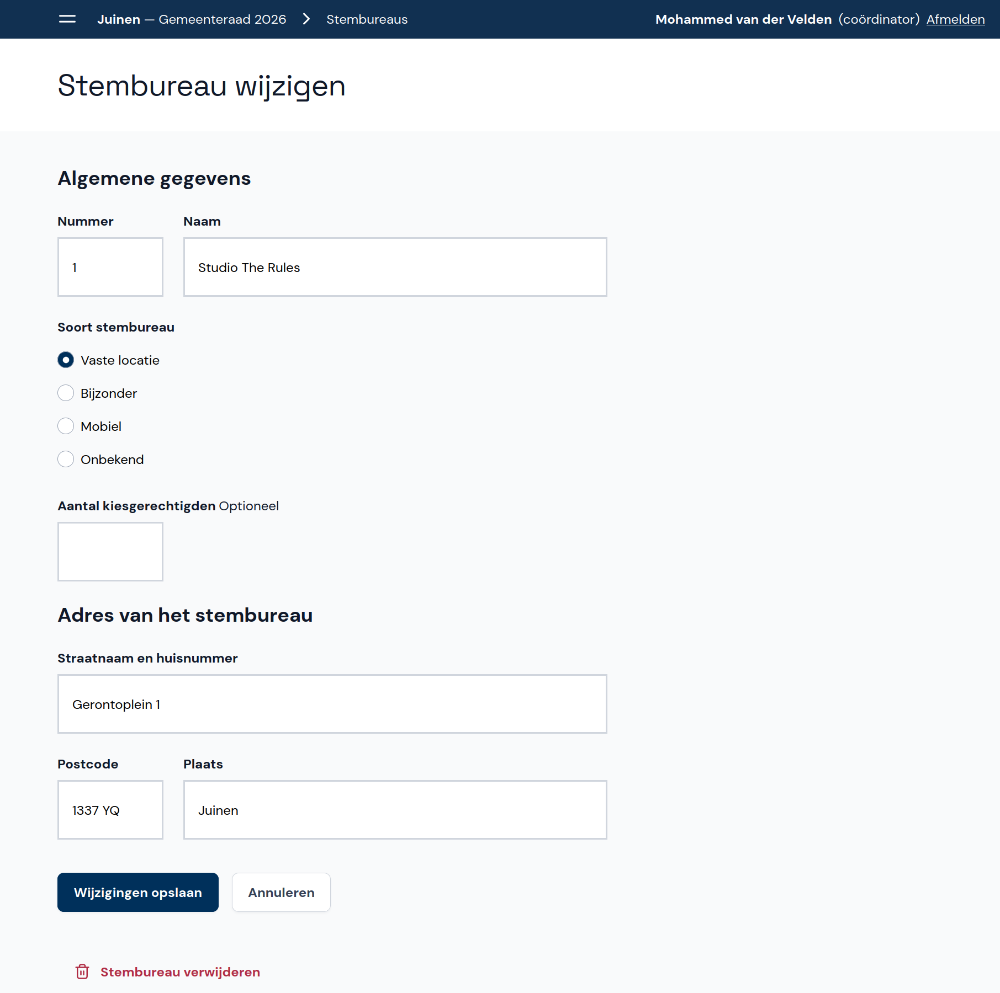

# Abacus - Instructies Coördinator

Welkom bij Abacus! Deze tool is ontwikkeld om de verkiezingsuitslagen per stembureau in te voeren en te controleren op fouten en afwijkende uitslagen. In dit document leggen we uit hoe je Abacus gebruikt als coördinator.

Na het tellen van de stemmen wordt voor elk stembureau een proces-verbaal ingevuld. De invoerders nemen de cijfers van de processen-verbaal over in Abacus. Als coördinator begeleid je de invoerders en help je waar mogelijk bij het oplossen van waarschuwingen, fouten en andere problemen bij de invoer. Ook kun je stembureaus aanmaken en wijzigen.

Wanneer alle invoerders klaar zijn, rond je de invoer af en kun je het proces-verbaal samen met het EML-telbestand downloaden.

## Inloggen en account instellen

Je krijgt inloginstructies van de beheerder of een andere coördinator. Vul de gegevens in op de inlogpagina. Als je al eerder ingelogd hebt, gebruik je het door jou ingestelde wachtwoord.

Wanneer je voor de eerste keer inlogt, stel je je account eerst in voor gebruik. Voer je naam in als er nog geen naam staat, of wijzig je naam als die onjuist is. Kies vervolgens een nieuw wachtwoord en vul dit twee keer in.

## Stembureaus beheren

Als coördinator kun je stembureaus toevoegen, wijzigen en verwijderen. Kijk hiervoor bij **Beheer verkiezingen** onder de betreffende verkiezing en klik op **Stembureaus**. Als er al stembureaus zijn toegevoegd, zie je die hier staan.

### Stembureau toevoegen

- Klik rechts op de knop **+ Stembureau toevoegen**.
[comment]: # (TODO: Instructies voor batch import toevoegen wanneer de stembureau-importfunctie klaar is, en aangeven dat deze instructies alleen bedoeld zijn voor afwijkende situaties.)

- Voer de gegevens van het stembureau in en geef aan welke soort stembureau het is. Als het aantal kiesgerechtigden van het stembureau bekend is kun je dit invullen, maar dat hoeft niet.
- Klik op **Opslaan en toevoegen**.

### Stembureau wijzigen of verwijderen

- Klik op het stembureau dat je wilt wijzigen of verwijderen.
- Wijzig het stembureau door de relevante gegevens te veranderen en vervolgens op **Wijzigingen opslaan** te klikken. Klik op **Annuleren** als je de wijzigingen toch niet wilt opslaan.
- Verwijder het stembureau door onderaan het scherm op **Stembureau verwijderen** te klikken.

## Statusoverzicht steminvoer

[comment]: # (TODO: instructies toevoegen voor doorklikken vanuit detailpagina naar de status van de steminvoer, zodra dit gebouwd is.)

Op deze pagina zie je in één oogopslag wat de status van de stembureaus is en en welke stembureaus nog ingevoerd moeten worden (de werkvoorraad). Hier zie je ook welke invoer speciale aandacht van jou als coordinator nodig heeft vanwege fouten of waarschuwingen.

## Fouten en waarschuwingen

De invoerders krijgen te maken met verschillende fouten en waarschuwingen, en zij overleggen met jou om tot een oplossing te komen. De oplossingen en handelingen voor de fouten en waarschuwingen vind je in het bijbehorende document in de toolkit.

## Verschil tussen eerste en tweede invoer

Wanneer een stembureau twee keer is ingevoerd, kan het voorkomen dat er een verschil is tussen de eerste en tweede invoer. Op het statusoverzicht zie je dit bovenaan staan.

Controleer beide invoeren om na te gaan welke invoer overeenkomt met het proces-verbaal. Klik op de correcte invoer en vervolgens op **Opslaan** om deze te bewaren. De andere invoer wordt weggegooid en moet opnieuw gedaan worden.

## Afronden en proces-verbaal opmaken

Wanneer de resultaten van alle stembureaus in jouw gemeente twee keer correct zijn ingevoerd, kun je de uitslag definitief maken en het proces-verbaal opmaken.

Klik op **Invoerfase afronden**. Op deze pagina kun je het proces-verbaal met of zonder het EML-telbestand downloaden.

## Activiteitenlog

In het activiteitenlog kun je zien welke gebruikers zijn ingelogd en uitgelogd en welke activiteiten ze hebben uitgevoerd. Dit kan handig zijn als je wilt nagaan wat er met een bepaalde invoer gebeurd is.

## Gebruikersbeheer

Gebruikersbeheer kan op dit moment alleen door de beheerder worden gedaan. Voor de coördinator is deze functie nog in ontwikkeling.
