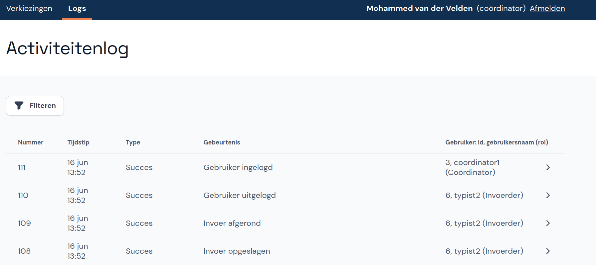

# Abacus - Instructies Coördinator

Welkom bij Abacus! Deze tool is ontwikkeld om de verkiezingsuitslagen per stembureau in te voeren en te controleren op fouten en afwijkende uitslagen. In dit document leggen we uit hoe je Abacus gebruikt als coördinator.

Na het tellen van de stemmen wordt voor elk stembureau een proces-verbaal ingevuld. De invoerders nemen de cijfers van de processen-verbaal over in Abacus. Als coördinator begeleid je de invoerders en help je waar mogelijk bij het oplossen van waarschuwingen, fouten en andere problemen bij de invoer. Ook kun je stembureaus aanmaken en wijzigen.

Wanneer alle invoerders klaar zijn, rond je de invoer af en kun je het proces-verbaal samen met het EML-telbestand downloaden.

## 1. Inloggen en account instellen

Je krijgt inloginstructies van de beheerder of een andere coördinator. Vul de gegevens in op de inlogpagina. Als je al eerder ingelogd hebt, gebruik je het door jou ingestelde wachtwoord.

Wanneer je voor de eerste keer inlogt, stel je je account eerst in voor gebruik. Voer je naam in als er nog geen naam staat, of wijzig je naam als die onjuist is. Kies vervolgens een nieuw wachtwoord en vul dit twee keer in.

## 2. Verkiezing

In het menu klik je onder **Verkiezingen** op de naam van de verkiezing. Je ziet dan een overzicht van de zitting en de status van de invoer.

Onder de zitting staat een overzicht met alle gegevens over deze verkiezing. Je kunt hier het volgende doen:

- Klik op de rij *Aantal kiesgerechtigden* om het aantal kiesgerechtigden te wijzigen. **Let op:** zorg ervoor dat dit getal juist is ingevuld voordat je de zitting begint.
- Klik op de rij *Stembureaus* om ze te beheren, zie [Stembureaus beheren](#3-stembureaus-beheren).
- Onderaan de pagina kun je de lege processen-verbaal voor deze verkiezing downloaden.

### 2.1. Details van de zitting

Op dit scherm voer je de plaatsnaam, datum en starttijd van de zitting in. Dit kun je op elk moment tijdens de zitting doen.

- Klik in het overzicht op **Details van de zitting**.
- Vul de plaats, datum en starttijd van de zitting in en klik op **Wijzigingen opslaan**.

Abacus stuurt je automatisch naar dit scherm als deze gegevens nog niet zijn ingevuld wanneer je de zitting afrondt.

### 2.2. Statusoverzicht steminvoer

Op deze pagina zie je in één oogopslag wat de status van de stembureaus is en en welke stembureaus nog ingevoerd moeten worden (de werkvoorraad). Hier zie je ook welke invoer speciale aandacht van jou als coördinator nodig heeft vanwege [fouten en/of waarschuwingen](#5-fouten-en-waarschuwingen).

- Klik vanuit het hoofdmenu onder de naam van de verkiezing op **Statusoverzicht steminvoer**.
- Je kunt ook eerst de verkiezing selecteren en daarna op **Bekijk voortgang** klikken.

## 3. Stembureaus beheren

Als er nog geen stembureaus zijn toegevoegd, doe je dit eerst. Je kunt een bestand met stembureaus importeren of de stembureaus handmatig toevoegen. Een bestand importeren is niet meer mogelijk als er al stembureaus aanwezig zijn. Klik in de melding op **Stembureaus beheren**.

### 3.1. Lijst met stembureaus importeren

Als je een EML-bestand met stembureaus (EML 110b) hebt, kun je dit direct toevoegen.

- Klik op de knop **Importeren uit een bestand**.
- Klik daarna op **Bestand kiezen** en kies het bestand.

- Je ziet nu alle stembureaus die uit het bestand zijn ingelezen.
- Controleer of alles klopt en klik op **Stembureaus importeren**.

### 3.2. Stembureau handmatig toevoegen

Je kunt stembureaus ook handmatig toevoegen om ervoor te zorgen dat de stembureaus in Abacus overeenkomen met de stembureaulijst die voorafgaand aan de verkiezingen is gepubliceerd.

- Als er nog geen stembureaus zijn toegevoegd, klik je in de melding op **Stembureaus beheren**.
- Klik daarna op **+ Handmatig invullen**.

- Als er wel stembureaus zijn, klik je in het hoofdmenu onder de juiste verkiezing op **Stembureaus** om naar het overzicht te gaan.
- Als je al in het voortgangsscherm van de verkiezing bent, kun je daar ook direct op **Stembureaus** klikken.
- Klik op de knop **+ Stembureau toevoegen**.

- Voer de gegevens van het stembureau in en geef aan welke soort stembureau het is.
- Als het aantal kiesgerechtigden van het stembureau bekend is kun je dit invullen, maar dat hoeft niet.
- Klik op **Opslaan en toevoegen**.

### 3.3. Stembureau wijzigen of verwijderen

- Klik op het stembureau dat je wilt wijzigen of verwijderen.
- Wijzig het stembureau door de relevante gegevens te veranderen en vervolgens op **Wijzigingen opslaan** te klikken. Klik op **Annuleren** als je de wijzigingen toch niet wilt opslaan.
- Verwijder het stembureau door onderaan het scherm op **Stembureau verwijderen** te klikken.

## 4. Gebruikers beheren

Als coördinator kun je alleen invoerders beheren. Alleen een beheerder kan accounts met de rol van beheerder of coördinator beheren.

- Klik in het hoofdmenu op **Gebruikers beheren**.

### 4.1. Gebruiker toevoegen

- Klik op **+ Gebruiker toevoegen**.
- Kies eerst of het account op naam staat of anoniem is. Voor een anoniem account moet de gebruiker bij de eerste keer inloggen de naam invoeren.

- Voer de gebruikersnaam, de volledige naam (behalve bij een anonieme invoerder) en een tijdelijk wachtwoord in. Bij de eerste keer inloggen moet de gebruiker het wachtwoord wijzigen.

### 4.2. Gebruiker wijzigen of verwijderen

- Klik onder **Gebruikers beheren** op de gebruiker die je wilt wijzigen.
- Wijzig de volledige naam of reset het wachtwoord. De gebruikersnaam en de rol kunnen niet gewijzigd worden.
- Verwijder de gebruiker door onderaan het scherm op **Gebruiker verwijderen** te klikken.

## 5. Fouten en waarschuwingen

Zowel tijdens als na de invoer kunnen er fouten en/of waarschuwingen ontstaan. Als coördinator los je ze samen met de invoerder op.

**Tijdens de invoer** kunnen de invoerders te maken hebben met verschillende fouten en/of waarschuwingen. Zij moeten dit met jou overleggen om tot een oplossing te komen.

**Na de invoer** zie je bovenaan in het statusoverzicht van de steminvoer of er fouten en/of waarschuwingen zijn. Klik op het stembureau om de fouten en/of waarschuwingen te bekijken.

### 5.1. Corrigeren en oplossen

In het algemeen gelden de volgende regels voor fouten en waarschuwingen:

- Heeft de invoerder een fout gemaakt tijdens het invoeren maar klopt het papieren proces-verbaal wel? Laat de invoerder dan de invoer corrigeren.
- Zit de fout in het papieren proces-verbaal? Los de fout dan daar op.

Bij sommige fouten en waarschuwingen moet je specifieke handelingen uitvoeren. Abacus geeft dan duidelijk aan wat je moet doen. Meer informatie over oplossingen en handelingen voor de fouten en waarschuwingen vind je in het bijbehorende document in de [Toolkit Verkiezingen gemeenteraadsverkiezingen 2026](https://www.kiesraad.nl/verkiezingen/gemeenteraden/documenten-gemeenteraadsverkiezing-2026/).

<!-- TODO: document waarnaar moet worden verwezen is nog in ontwikkeling, specifieke verwijzing toevoegen wanneer dit in de toolkit staat. Mogelijk kunnen we voor nu ook het document met validatieregels en plausibiliteitschecks gebruiken. -->

## 6. Verschil tussen eerste en tweede invoer

Wanneer een stembureau twee keer is ingevoerd, kan het voorkomen dat er een verschil is tussen de eerste en tweede invoer. Op het statusoverzicht zie je dit bovenaan staan.

Controleer beide invoeren om na te gaan welke invoer overeenkomt met het proces-verbaal. Klik op de correcte invoer en vervolgens op **Opslaan** om deze te bewaren. De andere invoer wordt weggegooid en moet opnieuw gedaan worden. Bewaar geen van beide invoeren als ze allebei niet overeenkomen met het proces-verbaal.

## 7. Afronden en proces-verbaal opmaken

Wanneer de resultaten van alle stembureaus in jouw gemeente twee keer correct zijn ingevoerd, kun je de uitslag definitief maken en het proces-verbaal opmaken.

- Klik op **Invoerfase afronden** en doe dit nogmaals ter bevestiging.
- Als de details van de zitting nog niet zijn ingevoerd, doe je dit nu. Daarna klik je op **Naar proces-verbaal**.
- Je invoer is afgerond. Op deze pagina download je een ZIP-bestand met het proces-verbaal en het EML-telbestand.

- Klik op **Terug naar overzicht** om de invoer af te ronden.
- Als je toch nog iets wilt wijzigen klik je op **Steminvoer hervatten**.

## 8. Activiteitenlog

In het activiteitenlog kun je zien welke gebruikers zijn ingelogd en uitgelogd en welke activiteiten ze hebben uitgevoerd. Dit kan handig zijn als je wilt nagaan wat er met een bepaalde invoer gebeurd is.

