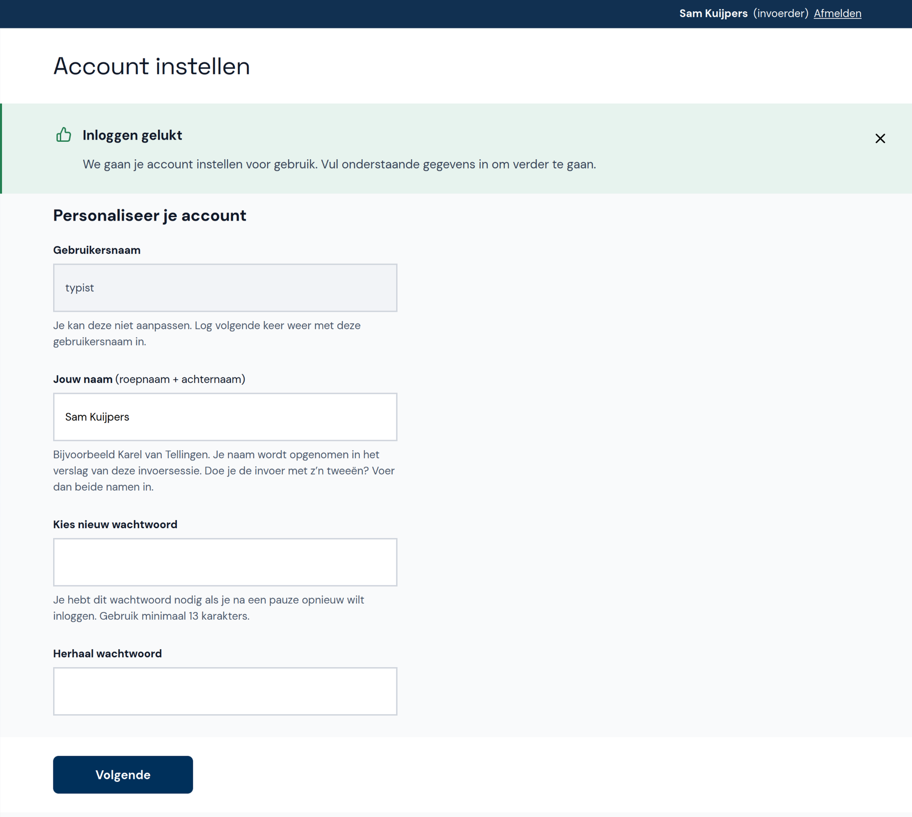
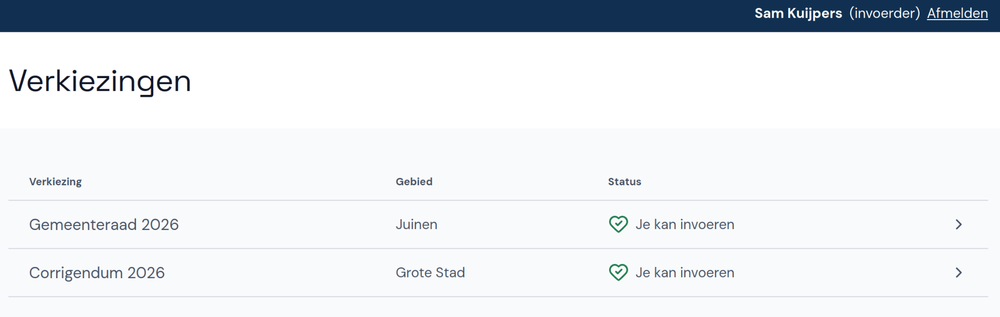
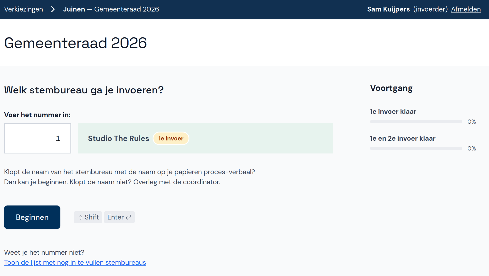
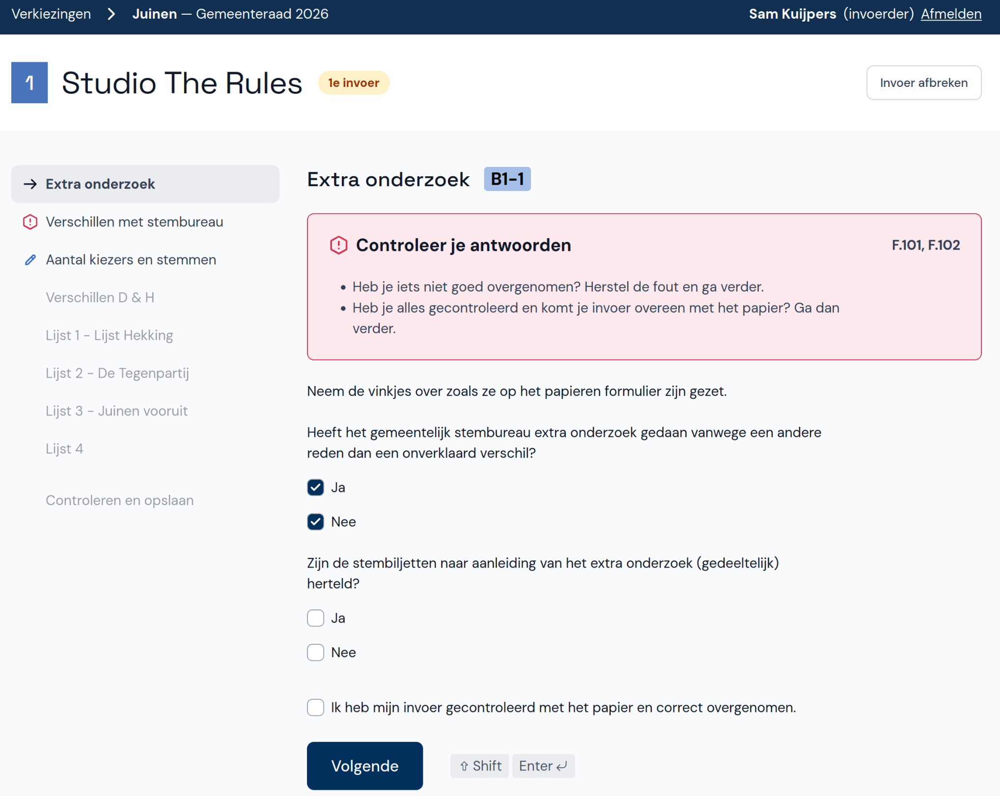
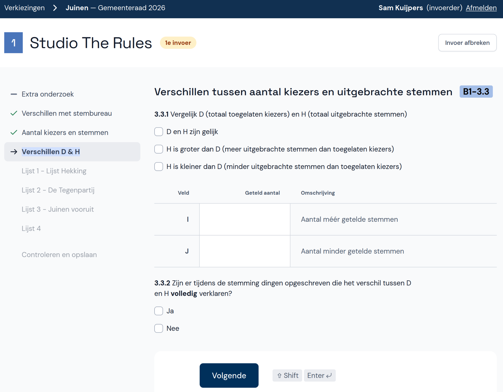
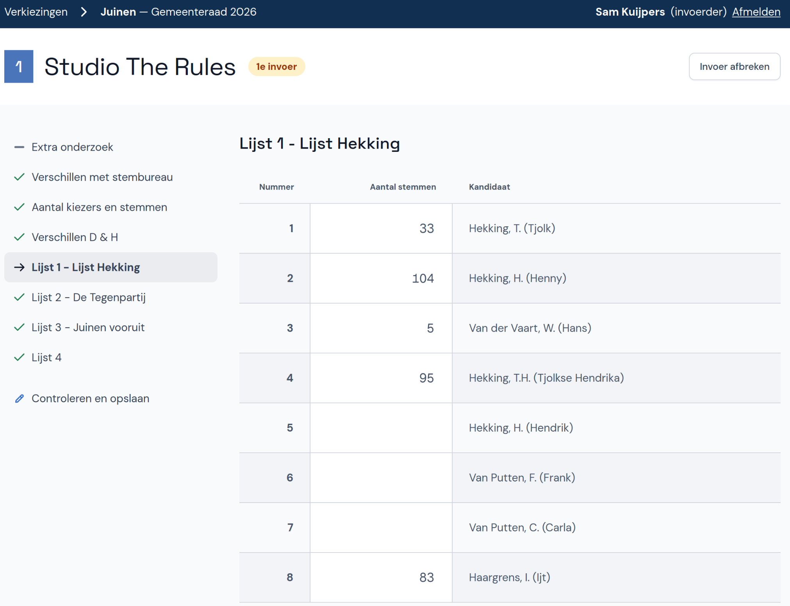
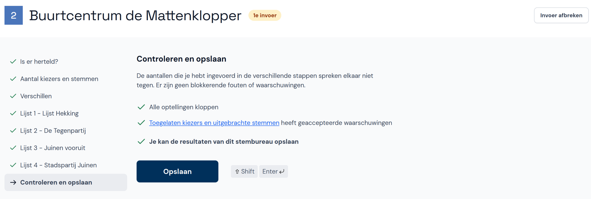

# Abacus - Instructies Invoerder

Welkom bij Abacus! Deze tool is ontwikkeld om de verkiezingsuitslagen per stembureau in te voeren en te controleren op fouten en afwijkende uitslagen. In dit document leggen we uit hoe je Abacus gebruikt als invoerder.

Na het tellen van de stemmen wordt voor elk stembureau een proces-verbaal ingevuld. De cijfers op dit proces-verbaal neem je over in Abacus. Vervolgens controleert de applicatie of de cijfers intern kloppen, bijvoorbeeld of de optellingen goed zijn. Ook wordt gecheckt of er bijzondere afwijkingen zijn, bijvoorbeeld als het aantal ongeldige stemmen hoog is. Als er fouten of waarschuwingen zijn, volg je de instructies op of overleg je het met je coördinator.

Elk stembureau wordt twee keer ingevoerd (door twee verschillende invoerders). De tweede invoerder krijgt een waarschuwing als diens invoer afwijkt van de eerste invoerder. Ook hier geldt dat je de instructies volgt of overlegt met je coördinator. Na de tweede invoer controleert Abacus of de eerste en tweede invoer overeenkomen. Als alles klopt is de invoer van het betreffende stembureau compleet.

## 1. Informatie vooraf

### 1.1. Navigeren en pauzeren

Je kunt in Abacus een aantal sneltoetsen gebruiken waarmee je handig naar andere velden navigeert. Dit zijn de sneltoetsen:

- Met `tab ↹`, `pijl omlaag ↓` of `enter ⏎` ga je naar het volgende veld.
- Met `shift ⇧`+`tab ↹` of `pijl omhoog ↑` ga je naar het vorige veld.
- Met `shift ⇧`+`pijl omlaag ↓` ga je naar het laatste veld op de pagina. Dit is handig als je geen aantallen meer hoeft in te vullen bij kandidaten en direct het totaal wilt invullen.
- Met `shift ⇧`+`enter ⏎` ga je naar de volgende pagina/lijst.

**Let op:** Je hoeft geen nullen in te voeren. Als je een veld leeg laat, wordt dat gezien als een nul. Je kunt direct met `tab ↹` naar het volgende veld gaan.

Als je even pauze wilt, klik dan rechtsboven op **Invoer afbreken** en vervolgens op **Invoer bewaren**. Na je pauze klik je onder **Je hebt nog een openstaande invoer** op het stembureau en kun je doorgaan waar je gebleven was.

### 1.2. Fouten en waarschuwingen

Tijdens de invoer kunnen er fouten en waarschuwingen ontstaan. In alle gevallen doe je het volgende:

- Controleer of je invoer overeenkomt met het papier en herstel eventuele fouten.
- Als alles klopt zet je een vinkje bij **Ik heb mijn invoer gecontroleerd met het papier en correct overgenomen** en klik je weer op **Volgende**.
- Kom je er niet uit? Overleg dan met de coördinator.

### 1.3. Tweede invoer

- Bij het stembureau staat ook aangegeven of je de eerste invoer of tweede invoer gaat doen. Voor beide invoeren zijn de instructies hetzelfde.
- Bij een tweede invoer zie je mogelijk extra waarschuwingen als jouw invoer verschilt met de eerste invoer. Zorg dan dat je invoer overeenkomt met het papier en herstel eventuele fouten. Als alles klopt zet je een vinkje bij **Ik heb mijn invoer gecontroleerd met het papier en correct overgenomen** en klik je weer op **Volgende**.

- Aan het einde van de invoer zie je de waarschuwingen en fouten nog een keer. Bespreek eerst de fouten met de coördinator. Als alles klopt zet je een vinkje bij **Ik heb de fouten besproken met de coördinator** en klik je op **Afronden**.

## 2. Inloggen en account instellen

Je krijgt inloginstructies van je coördinator. Vul de gegevens in en klik op **Inloggen**. Als je al eerder ingelogd hebt, gebruik je het door jou ingestelde wachtwoord.

Wanneer je voor de eerste keer inlogt, stel je je account eerst in voor gebruik. Voer je naam in als er nog geen naam staat, of wijzig je naam als die onjuist is. Kies vervolgens een nieuw wachtwoord en vul dit twee keer in.

## 3. Stembureau invoeren

### 3.1. Verkiezing en stembureau selecteren

Selecteer eerst de verkiezing waarvoor je stemmen wilt invoeren. Hier zie je ook wat de status van de verkiezing is.

Selecteer nu het stembureau:

- Voer het nummer in van het stembureau dat je wilt invoeren. Het nummer vind je op het proces-verbaal.
- Weet je het nummer niet, klik dan onderaan de pagina op **Toon de lijst met nog in te vullen stembureaus** en kies vervolgens het juiste stembureau.

### 3.2. Extra onderzoek

Op pagina 1 van het papieren formulier is aangegeven of er extra onderzoek is uitgevoerd.

- Neem de vinkjes over zoals ze in het proces-verbaal staan en klik op **Volgende**.
- Je ziet een fout als er twee vinkjes zijn gezet bij dezelfde vraag.
- Als de vragen op het papier niet zijn ingevuld, dan is er geen extra onderzoek uitgevoerd en kun je direct doorgaan naar de volgende pagina.

### 3.3. Verschillen met stembureau

Op pagina 2 van het papieren formulier is aangegeven of er verschillen zijn met de telresultaten van het stembureau.

- Neem de vinkjes over zoals ze in het proces-verbaal staan en klik op **Volgende**.
- Je ziet een fout als er twee vinkjes staan bij dezelfde vraag of als er niets is ingevuld.

### 3.4. Aantal kiezers en stemmen

Nu voer je de toegelaten kiezers en uitgebrachte stemmen in. Dit zijn de velden A tot en met H in rubriek B1 - 3.1 en 3.2 op pagina 4 en 5 van het papieren formulier.

- Neem de cijfers over zoals ze in het proces-verbaal staan en klik op **Volgende**.
- Je ziet een fout of waarschuwingen als de aantallen niet kloppen of afwijkingen bevatten.

### 3.5. Verschillen D & H

Op pagina 6 van het papieren formulier is aangegeven of er verschillen zijn tussen het aantal kiezers en het aantal uitgebrachte stemmen.

Neem de vinkjes en cijfers over zoals ze in het proces-verbaal staan en klik op **Volgende**.

### 3.6. Lijsten

Nu ga je invoeren hoeveel stemmen zijn geteld voor elke kandidaat op elke lijst. Neem de cijfers over zoals ze in het proces-verbaal staan.

- Lege velden en velden met een nul op het proces-verbaal kun je ook leeglaten in Abacus.
- Als je bij de kandidaten alle aantallen hebt ingevuld en je tot het totaal alleen maar lege velden ziet, ga je met `shift ⇧`+`pijl omlaag ↓` direct naar het invoerveld voor het totaal.
- Als je klaar bent met het invoeren van de lijst, klik je op **Volgende** of druk je op `shift ⇧`+`enter ⏎` om naar de volgende lijst te gaan.
- Je ziet een fout of waarschuwing als de opgetelde stemmen en het totaal niet gelijk zijn.
- Op het proces-verbaal staan ook velden voor het subtotaal van elke kolom. Deze kun je negeren.

### 3.7. Controleren en opslaan

Wanneer je de laatste lijst hebt ingevoerd, klik je op **Volgende**. De invoer wordt nu gecontroleerd en je ziet of er waarschuwingen zijn. Klik nu op **Opslaan**.

Als je nog een stembureau wilt invoeren, kun je direct een ander stembureaunummer invullen of een stembureau uit de lijst kiezen.

## 4. Invoer afbreken

Het kan zijn dat je even pauze wilt nemen of de invoer om een andere reden wilt onderbreken. Je kunt ook de invoer weggooien om eventueel opnieuw te beginnen.

Klik op **Invoer afbreken**. In een popup wordt gevraagd of je de invoer wilt bewaren. Als je later wilt doorgaan met invoeren, klik je op **Invoer bewaren**. Wil je de invoer weggooien, klik dan op **Niet bewaren**.
