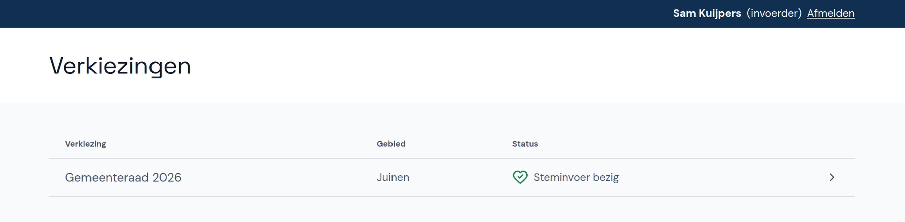
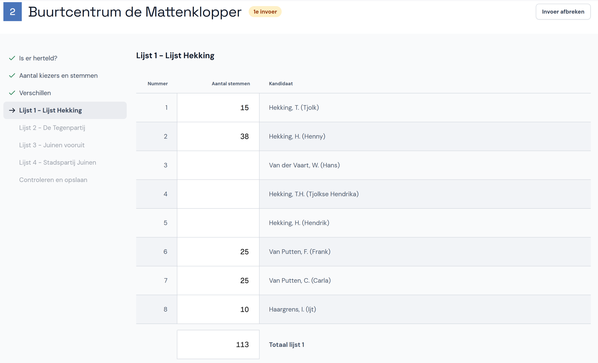

# Abacus - Instructies Invoerder

Welkom bij Abacus! Deze tool is ontwikkeld om de verkiezingsuitslagen per stembureau in te voeren en te controleren op fouten en afwijkende uitslagen. In dit document leggen we uit hoe je Abacus gebruikt als invoerder.

Na het tellen van de stemmen wordt voor elk stembureau een proces-verbaal ingevuld. De cijfers op dit proces-verbaal neem je over in Abacus. Vervolgens controleert de applicatie of de cijfers intern kloppen, bijvoorbeeld of de optellingen goed zijn. Ook wordt gecheckt of er bijzondere afwijkingen zijn, bijvoorbeeld als het aantal ongeldige stemmen hoog is. Als er fouten of waarschuwingen zijn, volg je de instructies op of overleg je het met je coördinator.

Elk stembureau wordt twee keer ingevoerd (door twee verschillende invoerders). De tweede invoerder krijgt een waarschuwing als diens invoer afwijkt van de eerste invoerder. Ook hier geldt dat je de instructies volgt of overlegt met je coördinator. Na de tweede invoer controleert Abacus of de eerste en tweede invoer overeenkomen. Als alles klopt is de invoer van het betreffende stembureau compleet.

## 1. Inloggen en account instellen

Je krijgt inloginstructies van je coördinator. Vul de gegevens in en klik op **Inloggen**. Als je al eerder ingelogd hebt, gebruik je het door jou ingestelde wachtwoord.

Wanneer je voor de eerste keer inlogt, stel je je account eerst in voor gebruik. Voer je naam in als er nog geen naam staat, of wijzig je naam als die onjuist is. Kies vervolgens een nieuw wachtwoord en vul dit twee keer in.

## 2. Stembureau invoeren

In de volgende stappen lees je hoe je een stembureau invoert. Gebruik hierbij de [cheatsheet](cheatsheet.md) met daarin de volgende informatie:

- [Hoe je kunt invoeren en welke sneltoetsen je gebruikt](cheatsheet.md#invoeren-en-sneltoetsen)
- [Wat je moet doen bij waarschuwingen en fouten](cheatsheet.md#waarschuwingen-en-fouten)
- [Hoe je een tweede invoer afrondt](cheatsheet.md#tweede-invoer)
- [Hoe je de invoer kunt pauzeren of onderbreken](cheatsheet.md#pauzeren-of-onderbreken)

 **Let op:** je mag het papieren proces-verbaal niet aanpassen, ook niet als je fouten ziet. In dat geval neem je de foute invoer over zoals het op het papier staat.

### 2.1. Verkiezing en stembureau selecteren

Selecteer eerst de verkiezing waarvoor je stemmen wilt invoeren. Hier zie je ook wat de status van de verkiezing is.

Selecteer nu het stembureau:

- Voer het nummer in van het stembureau dat je wilt invoeren. Het nummer vind je op het proces-verbaal.
- Weet je het nummer niet, klik dan onderaan de pagina op **Toon de lijst met nog in te vullen stembureaus** en kies vervolgens het juiste stembureau.

### 2.2. Extra onderzoek

Op pagina 1 van het papieren formulier is aangegeven of er extra onderzoek is uitgevoerd.

Neem de vinkjes over zoals ze in het proces-verbaal staan en klik op **Volgende**.

Als de vragen op het papier niet zijn ingevuld, dan is er geen extra onderzoek uitgevoerd en kun je direct doorgaan naar de volgende pagina.

### 2.3. Verschillen met stembureau

Op pagina 2 van het papieren formulier is aangegeven of er verschillen zijn met de telresultaten van het stembureau.

Neem de vinkjes over zoals ze in het proces-verbaal staan en klik op **Volgende**.

### 2.4. Aantal kiezers en stemmen

Nu voer je de toegelaten kiezers en uitgebrachte stemmen in. Dit zijn de velden A tot en met H in rubriek B1 - 3.1 en 3.2 op pagina 4 en 5 van het papieren formulier.

Neem de cijfers over zoals ze in het proces-verbaal staan en klik op **Volgende**.

### 2.5. Verschillen D & H

Op pagina 6 van het papieren formulier is aangegeven of er verschillen zijn tussen het aantal kiezers en het aantal uitgebrachte stemmen.

Neem de vinkjes en cijfers over zoals ze in het proces-verbaal staan en klik op **Volgende**.

### 2.6. Lijsten

Nu ga je invoeren hoeveel stemmen zijn geteld voor elke kandidaat op elke lijst. Neem de cijfers over zoals ze in het proces-verbaal staan. Hierbij gebruik je de sneltoetsen en instructies in de [cheatsheet](cheatsheet.md#invoeren-en-sneltoetsen).

### 2.7. Controleren en opslaan

Wanneer je de laatste lijst hebt ingevoerd, klik je op **Volgende**. De invoer wordt nu gecontroleerd en je ziet of er waarschuwingen zijn. Klik nu op **Opslaan**.

Als je nog een stembureau wilt invoeren, kun je direct een ander stembureaunummer invullen of een stembureau uit de lijst kiezen.

## 3. Extra zitting: corrigendum invoeren

Na het afronden van de invoerfase controleert het Centraal Stembureau de tellingen en de processen-verbaal. Het kan zijn dat het Centraal Stembureau zelf een fout ontdekt of een melding van een burger krijgt, bijvoorbeeld als die een stem niet kan terugvinden op het proces-verbaal. In dat geval kan het Centraal Stembureau opdracht geven om de resultaten van het stembureau te onderzoeken en dit leidt tot een corrigendum.

- Ook een corrigendum wordt twee keer ingevoerd. Het invoeren van een corrigendum werkt hetzelfde als het invoeren van een stembureau in de eerste zitting.
- Er is maar één verschil: Neem alleen de getallen die veranderd zijn over uit het corrigendum.
  - Als het vakje leeg is in het corrigendum, laat het dan ook leeg in Abacus.
  - Zodra je een veranderd getal hebt ingevuld, zet Abacus automatisch een kruis door het oude getal.

Wanneer je klaar bent, sla je de invoer op dezelfde manier op als in de eerste zitting.
