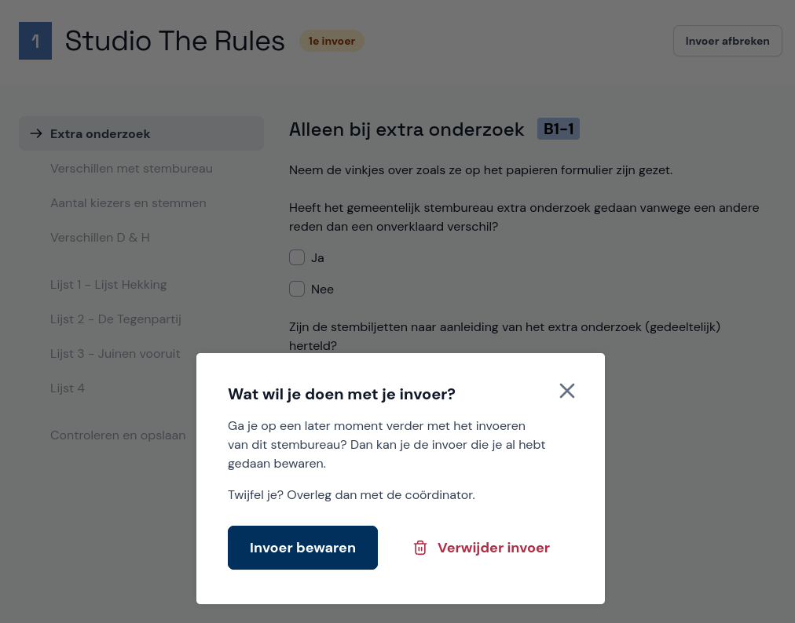

# Pauzeren of afbreken

Als je pauze neemt, selecteer dan rechtsboven **Invoer afbreken** en vervolgens **Invoer bewaren**.
Na je pauze selecteer je onder **Je hebt nog een openstaande invoer** het stembureau en kun je doorgaan waar je gebleven was.

## Invoer niet bewaren

Als je de invoer wil afbreken en weggooien, bijvoorbeeld omdat je opnieuw wil beginnen, selecteer je rechtsboven **Invoer afbreken** en vervolgens **Niet bewaren**.

