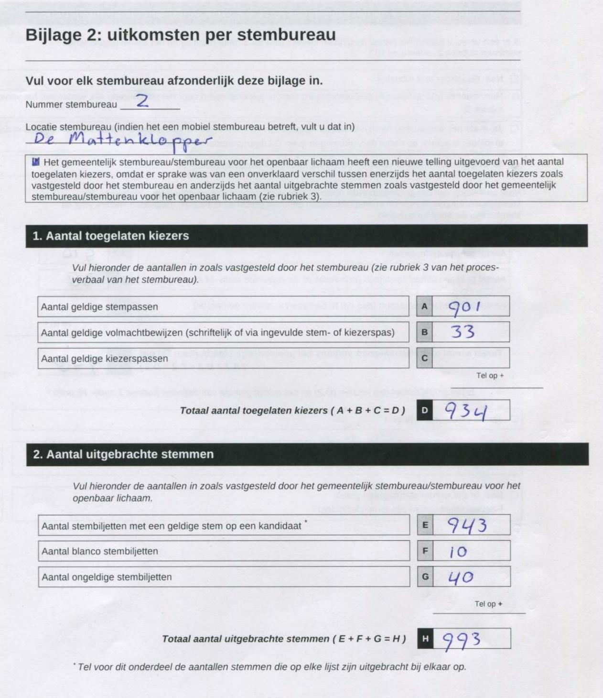
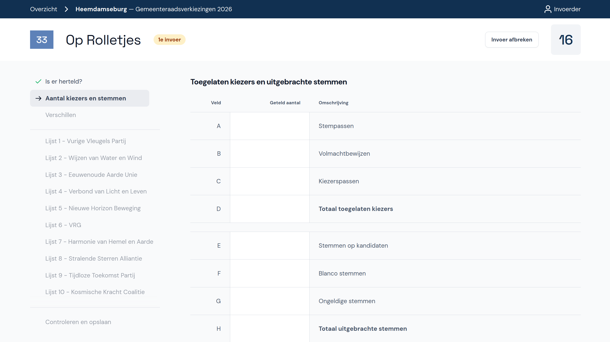

# Abacus gebruikersdocumentatie

Dit is de gebruikersdocumentatie, een cheatsheet en meer achtergrondinformatie bij [Abacus](https://github.com/kiesraad/abacus). 

## Wat is Abacus?

De Kiesraad ontwikkelt nieuwe software voor de berekening van de uitslag van de verkiezingen: Abacus, software voor verkiezingsuitslagen en zetelverdeling. Het programma telt uitslagen bij elkaar op en berekent de zetelverdeling. Abacus vervangt op termijn de module Uitslagvaststelling van het programma [Ondersteunende Software Verkiezingen](https://www.kiesraad.nl/verkiezingen/osv-en-eml) (OSV2020) en zal ingezet worden bij alle verkiezingen in Nederland.

Abacus is werk in uitvoering! Dit betekent dat de functionaliteit stapsgewijs wordt gebouwd. OSV2020 is de huidige software die bij verkiezingen wordt gebruikt. 

Het ontwikkelteam werkt nu aan een versie van Abacus die geschikt is voor toepassing bij verkiezingen voor de Gemeenteraad. Abacus kan worden ingezet als het af is, aan alle eisen voldoet en de Kiesraad besloten heeft over de toepassing.

## Abacus: de uitgebreide uitleg

Om te begrijpen wat Abacus is en hoe het wordt gebruikt, heb je eerst wat context nodig. Hieronder lees je alles over wat de Kiesraad is en doet, hoe het verkiezingsproces verloopt en op welk moment en op welke wijze Abacus in dit proces zal worden gebruikt.

Vind je het handiger om een video te bekijken, kijk dan naar de presentatie [Abacus: Software for Secure and Transparent Voting Results](https://youtu.be/qhYd_LNS2nQ) die we in november 2024 hebben gegeven op WICCON (in het Engels).

## De Kiesraad

De Kiesraad is een onafhankelijk adviesorgaan met 7 leden en staat voor een eerlijk, transparant en controleerbaar verkiezingsproces. De Raad is gevestigd in Den Haag. Het bureau van de Kiesraad bestaat inmiddels uit meer dan 40 medewerkers.

De taken van de Kiesraad zijn:

- Fungeren als centraal stembureau tijdens landelijke verkiezingen. Dit betekent dat de resultaten uit het hele land worden verzameld en bij elkaar worden opgeteld, waarna de zetelverdeling wordt berekend.
- De overheid en het parlement adviseren over het verkiezingsproces en de Kieswet. Dit doet de Kiesraad gevraagd en ongevraagd.
- Ondersteuning bieden aan gemeentes, politieke partijen en iedereen die actief is in het verkiezingsproces.
- De benodigde hulpmiddelen leveren voor het uitvoeren van verkiezingen, zoals modellen en processen, maar ook technologie en software. Hieronder valt de software voor het optellen van stemmen en de zetelverdeling.

Het wettelijke kader voor de verkiezingen is de Kieswet met het bijbehorende Kiesbesluit en de Kiesregeling. Dit kader verandert als gevolg van wetgeving die is ingezet om de ontwikkeling van nieuwe verkiezingssoftware te ondersteunen. Klik op de onderstaande links voor meer informatie:

- [Kieswet](https://wetten.overheid.nl/BWBR0004627/)
- [Kiesregeling](https://wetten.overheid.nl/BWBR0034180/)
- [Kiesbesluit](https://wetten.overheid.nl/BWBR0004632/)
- [Website van de Kiesraad](https://www.kiesraad.nl/).

## Het verkiezingsproces

In Nederland stemmen we op papier. In het stembureau gelden strikte regels om het stemgeheim te bewaren.

*Beeld: ©Kiesraad, Martijn Beekman*

Na het sluiten van de stembussen worden alle stemmen met de hand geteld, waarbij een vier-ogenprincipe wordt gehanteerd. De stemmen worden op lijst gesorteerd waarna de stemmen per kandidaat worden geteld.

*Beeld: ©Kiesraad, Martijn Beekman*

Wanneer alle stemmen geteld zijn, vult de voorzitter van het stembureau alle uitkomsten in op een proces-verbaal. Het totale aantal toegelaten kiezers (met stempas, volmacht en kiezerspas), het aantal uitgebrachte stemmen en het eventuele verschil daartussen worden eerst ingevuld. Vervolgens worden alle stemmen per kandidaat ingevuld[^1]. Dat ziet er als volgt uit:

Dan wordt alles naar een centrale plek in de gemeente gebracht (meestal het gemeentehuis), waar het gemeentelijk stembureau de werkzaamheden overneemt.

[^1]: Het proces waarbij alle stemmen per kandidaat direct in het stembureau worden geteld heet *decentrale stemopneming*.      In sommige gemeentes tellen de stembureaus alleen de stemmen per lijst, waarna de stemmen per kandidaat op bij het gemeentelijk stembureau worden geteld. Dit heet *centrale stemopneming*.

### Gemeentelijk stembureau, hoofdstembureau, centraal stembureau
Wanneer alle documenten bij het gemeentelijk stembureau zijn kan het optellen beginnen.

Hieronder zie je hoe het gehele proces van het optellen van stemmen verloopt voor landelijke verkiezingen. Andere verkiezingen zijn over het algemeen eenvoudiger.

- **Blok 1: Stembureau** - Zoals hierboven is uitgelegd, worden de stemmen geteld in het stembureau en de tellingen worden ingevuld op het proces-verbaal.
- **Blok 2: GSB** - Alle processen-verbaal van de stembureaus worden op het gemeentelijk stembureau ingevoerd, waarbij de software de resultaten controleert en eventuele fouten en waarschuwingen weergeeft. Wanneer deze opgelost zijn, kan de invoer worden afgerond en genereert de software het proces-verbaal en het EML_NL-bestand[^2] van het gemeentelijk stembureau.
- **Blok 3: HSB** - Het proces van blok 2 herhaalt zich bij de hoofdstembureaus van de kieskringen. Hier worden de processen-verbaal van de gemeentelijke stembureaus ingevoerd, gecontroleerd en afgerond. De software maakt het proces-verbaal en het EML_NL-bestand van het hoofdstembureau.
- **Blok 4: CSB** - Op het centraal stembureau worden de processen-verbaal van de hoofdstembureaus ingevoerd, gecontroleerd en afgerond. De software maakt het proces-verbaal en het EML_NL-bestand van het centraal stembureau. Aan de hand van deze gegevens wordt de zetelverdeling berekend.

In blok 2, 3 en 4 biedt software ondersteuning, en hier komt Abacus dan ook aan bod.

[^2]: EML staat voor Election Markup Language. Het bestandsformaat [EML_NL](https://www.kiesraad.nl/verkiezingen/osv-en-eml/eml-standaard) is hierop gebaseerd en aangepast voor Nederlandse verkiezingen.

### Papier is leidend

In het verkiezingsproces is papier leidend. Dat zorgt voor controleerbaarheid en transparantie, en dit zijn belangrijke waarborgen voor de integriteit van het verkiezingsproces. De software wordt gebruikt ter ondersteuning van het papieren proces.

### Controleprotocol optellingen

Het controleprotocol optellingen is de afsluiting van het papieren proces. Buiten de software om
wordt de optelling gecontroleerd, door middels een steekproef drie willekeurig gekozen lijsten met de hand na te rekenen.
Hiermee wordt gecontroleerd op invoerfouten en andere wijzigingen die de uitslag kunnen beïnvloeden. Dit protocol is dus een waarborg om te controleren of het papieren spoor en het digitale spoor met elkaar kloppen.

### Controleprotocol opmerkelijke uitslagen

De controle op bijzonderheden in de uitslagen, zoals een hoog aantal blanco stemmen of mogelijke
verwisseling van kandidaten, wordt gedaan aan de hand van data-analyse. Hiervoor heeft de
Kiesraad analysetools gebouwd die op [GitHub](https://github.com/kiesraad/HCP) beschikbaar zijn. Om de gemeentes te ondersteunen
worden deze controles zoveel als mogelijk ook in Abacus opgenomen. Dat voorkomt verrassingen en
helpt om fouten in een vroeg stadium op te sporen.

## De rol van Abacus

Het doel van Abacus is om de papieren processen-verbaal te digitaliseren en te helpen met de controle op de optellingen, zodat tel- en schrijffouten kunnen worden gedetecteerd en voorkomen. De software wordt ontwikkeld ter vervanging van het onderdeel Uitslagvaststelling (U) van OSV2020. Hierbij hebben we een aantal doelen gesteld:

- De integriteit, transparantie en controleerbaarheid van het gehele proces ondersteunen.
- Gebruiksvriendelijke interface en technologie implementeren.
- Volledig open source ontwikkelen.
- De oplossing zelf ontwikkelen en beheren.

Abacus wordt in de eerste instantie ontwikkeld voor de Gemeenteraadsverkiezingen in maart 2026. Meer informatie over de functionaliteit die wordt gebouwd vind je in [Functionaliteit voor Abacus 1.0](https://github.com/kiesraad/abacus/blob/main/documentatie/functionaliteit/versie-1.0-gr2026.md).

### Gebruiksvriendelijkheid

Omdat er niet al te vaak verkiezingen zijn, maken de gebruikers slechts korte tijd gebruik van verkiezingssoftware. Daarom is het van groot belang dat Abacus zo gebruiksvriendelijk mogelijk is. Daarom proberen we de invoer zo intuitief mogelijk te maken:

- Er worden regelmatige gebruikerstests gedaan met echte gebruikers.
- De invoer wordt in kleinere secties gedaan met een validatiecheck na elke invoer.
- De software wordt geoptimaliseerd voor gebruik met een toetsenbord en is eenvoudig aan te leren.
- De software geeft duidelijk aan hoe onjuiste of inconsistente invoer kan worden opgelost.
- De software wordt aangeleverd met duidelijke documentatie en instructiemateriaal.

Dit is een voorbeeld van de gebruikersinterface:

### Functionaliteit

In de afbeelding hieronder zie je hoe Abacus werkt op het gemeentelijk stembureau. Voor landelijke verkiezingen wordt dit proces herhaald op het hoofdstembureau en centraal stembureau, zoals hierboven beschreven.

**LET OP: dit is een concept en is nog in ontwikkeling.**

- Bovenaan staat IMPORT: gebruikers kunnen kandidaten en verkiezingsdefinities in EML-formaat importeren in Abacus.
- Links staat INVOER: gebruikers kunnen verkiezingsresultaten invoeren, inclusief verklaringen over ontbrekende stembiljetten/stempassen en klachten van kiezers.
Abacus telt de resultaten op en controleert ze.
- Rechts staat ONDERTEKENING: de data wordt ondertekend met een handtekening van de voorzitter van het gemeentelijk stembureau.
- Onderaan staat EXPORT: de verkiezingsresultaten worden geëxporteerd als EML_NL-bestand en als PDF-bestand. De bestanden kunnen van de server gehaald worden voor verdere verspreiding.

### Technische keuzes en architectuur

Abacus zal worden gedraaid op een gesloten netwerk zonder internettoegang. De backend draait op één machine en kan via de webbrowser (frontend) worden benaderd vanaf andere computers op het netwerk.

Voor de frontend wordt TypeScript gebruikt, een meer uitgebreide versie van JavaScript met typing. Voor de gebruikersinterface wordt de populaire library React gebruikt.

De backend wordt gemaakt met Rust, een high-level programmeertaal waarmee je efficiënt kunt programmeren. Het unieke systeem van '[ownership](https://doc.rust-lang.org/book/ch04-01-what-is-ownership.html)' in Rust voorkomt geheugenfouten, en de taal heeft een '[strict type system](https://doc.rust-lang.org/book/ch03-02-data-types.html)' waardoor minder bugs ontstaan. Ook is dit een populaire, open-source programmeertaal met een grote community.

Voor de database wordt SQLite gebruikt. Deze library is populair, lichtgewicht en gebruiksvriendelijk voor developers, en bovendien is SQLite een '[zero-configuration database](https://www.sqlite.org/zeroconf.html)'. Dit betekent dat installeren niet nodig is, zodat de developer meteen aan de slag kan.

Voor meer informatie over onze keuzes en de onderbouwingen hiervan lees je het document [Overwegingen talen en frameworks](https://github.com/kiesraad/abacus/blob/main/documentatie/softwarearchitectuur/overwegingen-talen-en-frameworks.md).

Voor de architectuur kun je beginnen bij het [Overzicht van de softwarearchitectuur](https://github.com/kiesraad/abacus/blob/main/documentatie/softwarearchitectuur/Overzicht.md).

De UI/UX designs vind je in onze [Figma](https://www.figma.com/design/xHDfsv69Nhmk3IrWC0303B/Public---Kiesraad---Abacus-optelsoftware?node-id=3190-28385&t=VnghjibSJMqrQepm-1).

### Security

Veiligheid is een van de belangrijkste pijlers voor Abacus, om een zo hoog mogelijke betrouwbaarheid van de verkiezingsuitslagen te kunnen garanderen. Dit doen we op de volgende manieren:

- Invoer volgens het vier-ogenprincipe: elk proces-verbaal wordt twee keer ingevoerd door verschillende gebruikers.
- Afzenderverificatie: hiermee wordt gegarandeerd dat bestanden met verkiezingsuitslagen die met Abacus zijn gemaakt, afkomstig zijn van het juiste stembureau en dat ze niet bedoeld of onbedoeld gewijzigd zijn.
- Air-gapped: Abacus wordt air-gapped en lokaal gedraaid.
- Er worden interne code-reviews gedaan en we laten ook externe code-reviews uitvoeren.
- Ook zal er externe pentesting worden uitgevoerd.
- Er wordt telkens gecontroleerd of de functionaliteit (nog steeds) aan de wettelijke vereisten voldoet.

### Werkwijze

Ons team werkt volgens deze principes:

- De software is beschikbaar onder de EU PL 1.2-licentie en het team werkt op deze openbare GitHub-repository. Ook de pull requests zijn openbaar.
- We hebben een continuous integration pipeline met tests en linting voor de frontend en backend.
- Als een teamlid code wijzigt, moeten minimaal 2 andere teamleden die wijzigingen reviewen en goedkeuren voordat de wijziging wordt overgenomen.
- Als we nieuwe code toevoegen, maken we meteen tests die de werking van die code controleren. De nieuwe tests moeten in dezelfde PR zitten als de nieuwe functionaliteit.
- De UI/UX designs op basis waarvan nieuwe functionaliteit wordt gebouwd zijn ook openbaar op Figma.
- Op ons [board](https://github.com/orgs/kiesraad/projects/1) zie je waar het team mee bezig is. Hier kun je ook de epics bekijken.

Voor meer informatie over onze werkwijzen kun je de volgende links bekijken:

- De [werkwijze op GitHub](https://github.com/kiesraad/abacus/blob/main/documentatie/ontwikkelproces/GitHub-werkwijze.md)
- Het [proces voor ontwikkeling en releases](https://github.com/kiesraad/abacus/blob/main/documentatie/ontwikkelproces/proces-ontwikkeling-en-releases.md)
- De [methode voor refinement](https://github.com/kiesraad/abacus/blob/main/documentatie/ontwikkelproces/refinement.md)
- De [tools](https://github.com/kiesraad/abacus/blob/main/documentatie/ontwikkelproces/test-tooling.md) die het team gebruikt voor tests en hoe we omgaan met [testen en kwaliteit](https://github.com/kiesraad/abacus/blob/main/documentatie/ontwikkelproces/testen-en-kwaliteit.md)

## Feedback

Feedback is meer dan welkom! Heb je iets gezien of gewoon een vraag, stuur dan een mail naar abacus[@]kiesraad.nl. Zie de [readme](https://github.com/kiesraad/abacus/blob/main/README.md) op de hoofdpagina van deze repository voor meer informatie over hoe je kunt bijdragen.
