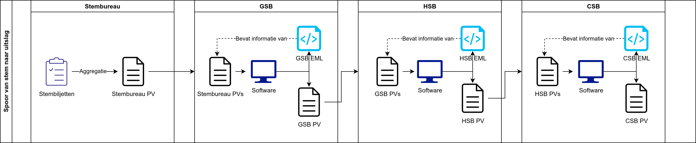

# Gemeentelijk stembureau, hoofdstembureau, centraal stembureau

Wanneer alle documenten bij het gemeentelijk stembureau zijn kan het optellen beginnen.

Hieronder zie je hoe het gehele proces van het optellen van stemmen verloopt voor landelijke verkiezingen. Andere verkiezingen zijn over het algemeen eenvoudiger.

- **Blok 1: Stembureau** - Zoals hierboven is uitgelegd, worden de stemmen geteld in het stembureau en de tellingen worden ingevuld op het proces-verbaal.
- **Blok 2: GSB** - Alle processen-verbaal van de stembureaus worden op het gemeentelijk stembureau ingevoerd, waarbij de software de resultaten controleert en eventuele fouten en waarschuwingen weergeeft. Wanneer deze opgelost zijn, kan de invoer worden afgerond en genereert de software het proces-verbaal en het EML_NL-bestand[^2] van het gemeentelijk stembureau.
- **Blok 3: HSB** - Het proces van blok 2 herhaalt zich bij de hoofdstembureaus van de kieskringen. Hier worden de processen-verbaal van de gemeentelijke stembureaus ingevoerd, gecontroleerd en afgerond. De software maakt het proces-verbaal en het EML_NL-bestand van het hoofdstembureau.
- **Blok 4: CSB** - Op het centraal stembureau worden de processen-verbaal van de hoofdstembureaus ingevoerd, gecontroleerd en afgerond. De software maakt het proces-verbaal en het EML_NL-bestand van het centraal stembureau. Aan de hand van deze gegevens wordt de zetelverdeling berekend.

In blok 2, 3 en 4 biedt software ondersteuning, en hier komt Abacus dan ook aan bod.

[^2]: EML staat voor Election Markup Language. Het bestandsformaat [EML_NL](https://www.kiesraad.nl/verkiezingen/osv-en-eml/eml-standaard) is hierop gebaseerd en aangepast voor Nederlandse verkiezingen.
