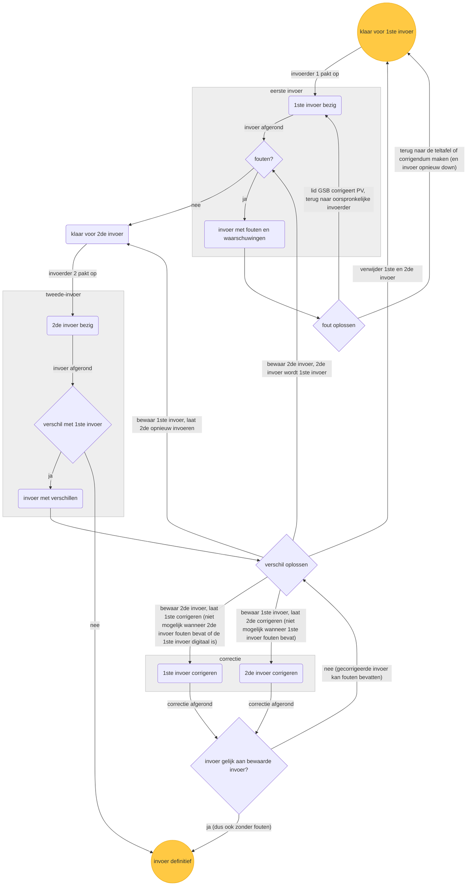

# Afhandeling fouten en verschillen door coördinator

Deze flowchart beschrijft hoe de coördinator (GSB of CSB) invoer met fouten of verschillen afhandelt.

Als de eerste invoer fouten bevat, moeten die opgelost worden. Dit betekent dat de tweede invoer alleen kan starten, nadat alle fouten die gedetecteerd zijn tijdens de eerste invoer, zijn opgelost.

Als de tweede invoer fouten bevat, heeft die dus per definitie verschillen met de eerste invoer. In dat geval moet de coördinator eerst de verschillen oplossen. Als de coördinator besluit de tweede invoer te behouden, dan moet als volgende stap de fouten opgelost worden.

Bij het oplossen van verschillen kan de coördinator er, in plaats van de afwijkende invoer helemaal opnieuw te laten doen, ook voor kiezen om alleen de afwijkende velden te laten corrigeren door de oorspronkelijke invoerder van die invoer. Bij de correctie worden de velden met verschillen leeggemaakt en gemarkeerd met waarschuwing. De invoerder kan in de correctie-invoer niet zien of nieuwe invoer afwijkt ten opzichte van de andere invoer. Komt de gecorrigeerde invoer na de correctie nog steeds niet overeen met de bewaarde invoer, dan moet de coördinator de verschillen opnieuw oplossen.

Correctie is alleen mogelijk voor een handmatige invoer. Een digitale invoer (bij het CSB is de eerste invoer geïmporteerd uit het tellingbestand van het GSB) kan niet gecorrigeerd worden, Abacus toont dan een melding. Alleen handmatig opnieuw invoeren is mogelijk.

Correctie is verder alleen mogelijk als de invoer die bewaard wordt zelf geen fouten bevat. Bevat de te bewaren invoer fouten, dan wordt de correctie-optie niet aangeboden en wordt er een melding getoond. Na bevestigen wordt de bewaarde invoer de eerste invoer en moeten de fouten daarin opgelost worden.

Een gecorrigeerde invoer kan wél nieuwe fouten bevatten. Daardoor kan ook de eerste invoer fouten bevatten op het moment dat de coördinator verschillen oplost. Ook dan geldt de regel hierboven: de invoer met fouten kan niet bewaard worden in combinatie met een correctie van de tweede invoer.

