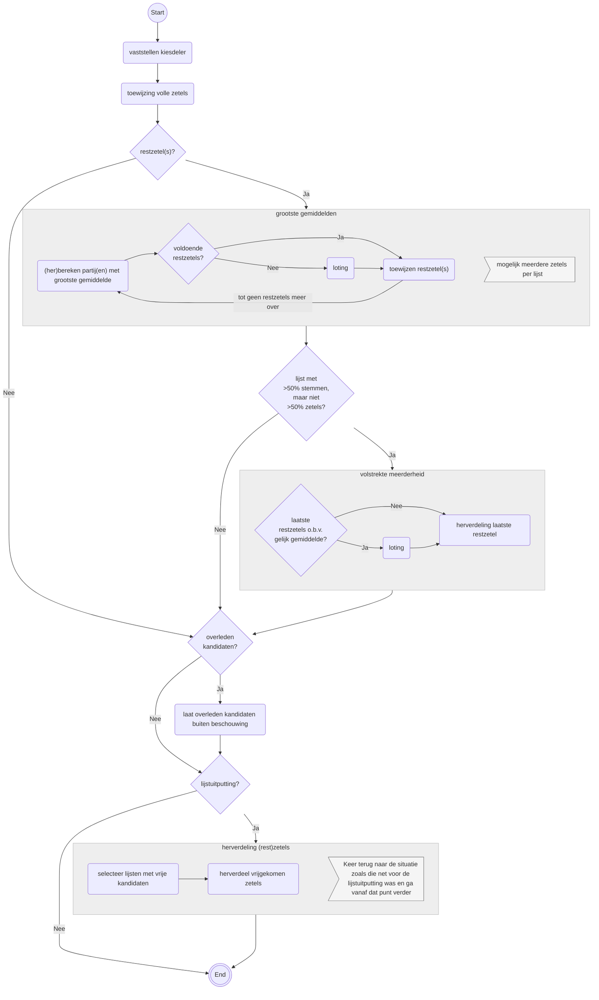

# Zetelverdeling gemeenteraadsverkiezingen

Als er geen restzetels zijn, dus alle zetels toegekend worden tijdens "toewijzing volle zetels", dan zal een partij met een volstrekte meerderheid aan stemmen ook al de volstrekte meerderheid aan zetels hebben.

## 19 of meer zetels

## Minder dan 19 zetels

```mermaid
flowchart
    %% styling
    classDef greyFill fill:#eee,stroke:#bbb;
    classDef comment fill:#f5f5f5,stroke:#888;

    %% elements
    flow_start((Start))
    flow_end(((End)))

    vaststellen_kiesdeler(vaststellen kiesdeler)
    toewijzing_volle_zetels(toewijzing volle zetels)

    restzetels{"restzetel(s)?"}

    bereken_overschotten_van_partijen("bereken overschotten<br/>van partijen")
    gelijke_overschotten{onvoldoende<br/>restzetels<br/>bij gelijk<br/>overschot?}
    loting_grootste_overschotten(loting)
    toewijzen_restzetels_grootste_overschotten("toewijzen restzetel(s)")
    comment_grootste_overschotten>max. 1 zetel per lijst]
    class comment_grootste_overschotten comment

    restzetels_na_overschotten{"restzetel(s)<br/>over?"}

    bereken_gemiddelden_van_partijen(bereken gemiddelden<br/>van partijen)
    gelijke_gemiddelden_1{"onvoldoende<br/>restzetels<br/>bij gelijk<br/>gemiddelde?"}
    loting_grootste_gemiddelden_1(loting)
    toewijzen_restzetels_grootste_gemiddelden_1("toewijzen restzetel(s)")
    comment_grootste_gemiddelden_1>max. 1 zetel per lijst]
    class comment_grootste_gemiddelden_1 comment

    restzetels_na_gemiddelden_1{"restzetel(s)<br/>over?"}

    bereken_partijen_met_grootste_gemiddelde("(her)bereken partij(en) met grootste gemiddelde")
    gelijke_gemiddelden_2{"onvoldoende<br/>restzetels<br/>bij gelijk<br/>gemiddelde?"}
    loting_grootste_gemiddelden_2(loting)
    toewijzen_restzetels_grootste_gemiddelden_2("toewijzen restzetel(s)")
    comment_grootste_gemiddelden_2>mogelijk meerdere zetels per lijst]
    class comment_grootste_gemiddelden_2 comment

    meerderheid_aan_stemmen_maar_niet_zetels{lijst met<br/>>50% stemmen,<br/>maar niet<br/>>50% zetels?}
    laatste_restzetels_obv_gelijk_gemiddelde_of_overschot{laatste<br/>restzetels o.b.v.<br/>gelijk gemiddelde of<br/>gelijk overschot?}
    loting_volstrekte_meerderheid(loting)
    herverdeling_laatste_restzetel(herverdeling laatste restzetel)

    overleden_kandidaten{"overleden<br/>kandidaten?"}
    overleden_kandidaten_buiten_beschouwing("laat overleden kandidaten buiten beschouwing")

    lijstuitputting{"lijstuitputting?"}
    lijsten_met_vrije_kandidaten("selecteer lijsten met vrije kandidaten")
    herverdeling_vrijgekomen_zetels("herverdeel vrijgekomen zetels")
    comment_herverdeling>Keer terug naar de situatie zoals die net voor de lijstuitputting was en ga vanaf dat punt verder]
    class comment_herverdeling comment

    %% flow
    flow_start --> vaststellen_kiesdeler
    vaststellen_kiesdeler --> toewijzing_volle_zetels

    toewijzing_volle_zetels --> restzetels
    restzetels --->|Nee| overleden_kandidaten
    restzetels -->|Ja| grootste_overschotten

    subgraph grootste_overschotten["grootste overschotten"]
        direction LR
        bereken_overschotten_van_partijen --> gelijke_overschotten
        gelijke_overschotten -->|Nee| toewijzen_restzetels_grootste_overschotten
        gelijke_overschotten -->|Ja| loting_grootste_overschotten
        loting_grootste_overschotten --> toewijzen_restzetels_grootste_overschotten
        toewijzen_restzetels_grootste_overschotten ~~~ comment_grootste_overschotten
    end
    class grootste_overschotten greyFill;

    grootste_overschotten --> restzetels_na_overschotten
    restzetels_na_overschotten -->|Nee| meerderheid_aan_stemmen_maar_niet_zetels
    restzetels_na_overschotten -->|Ja| grootste_gemiddelden_1

    subgraph grootste_gemiddelden_1["grootste gemiddelden - 1"]
        direction LR
        bereken_gemiddelden_van_partijen --> gelijke_gemiddelden_1
        gelijke_gemiddelden_1 -->|Nee| toewijzen_restzetels_grootste_gemiddelden_1
        gelijke_gemiddelden_1 -->|Ja| loting_grootste_gemiddelden_1
        loting_grootste_gemiddelden_1 --> toewijzen_restzetels_grootste_gemiddelden_1
        toewijzen_restzetels_grootste_gemiddelden_1 ~~~ comment_grootste_gemiddelden_1
    end
    class grootste_gemiddelden_1 greyFill;

    grootste_gemiddelden_1 --> restzetels_na_gemiddelden_1
    restzetels_na_gemiddelden_1 -->|Nee| meerderheid_aan_stemmen_maar_niet_zetels
    restzetels_na_gemiddelden_1 -->|Ja| grootste_gemiddelden_2

    subgraph grootste_gemiddelden_2["grootste gemiddelden - 2"]
        bereken_partijen_met_grootste_gemiddelde --> gelijke_gemiddelden_2
        gelijke_gemiddelden_2 -->|Nee| toewijzen_restzetels_grootste_gemiddelden_2
        gelijke_gemiddelden_2 -->|Ja| loting_grootste_gemiddelden_2
        loting_grootste_gemiddelden_2 --> toewijzen_restzetels_grootste_gemiddelden_2
        toewijzen_restzetels_grootste_gemiddelden_2 -->|tot geen restzetels meer over| bereken_partijen_met_grootste_gemiddelde
        toewijzen_restzetels_grootste_gemiddelden_2 ~~~ comment_grootste_gemiddelden_2
    end
    class grootste_gemiddelden_2 greyFill;

    grootste_gemiddelden_2 --> meerderheid_aan_stemmen_maar_niet_zetels

    meerderheid_aan_stemmen_maar_niet_zetels -->|Ja| volstrekte_meerderheid
    meerderheid_aan_stemmen_maar_niet_zetels --->|Nee| overleden_kandidaten

    subgraph volstrekte_meerderheid["volstrekte meerderheid"]
        direction LR
        laatste_restzetels_obv_gelijk_gemiddelde_of_overschot -->|Ja| loting_volstrekte_meerderheid
        laatste_restzetels_obv_gelijk_gemiddelde_of_overschot -->|Nee| herverdeling_laatste_restzetel
        loting_volstrekte_meerderheid --> herverdeling_laatste_restzetel
    end
    class volstrekte_meerderheid greyFill;

    volstrekte_meerderheid ---> overleden_kandidaten

    overleden_kandidaten -->|Nee| lijstuitputting
    overleden_kandidaten -->|Ja| overleden_kandidaten_buiten_beschouwing
    overleden_kandidaten_buiten_beschouwing --> lijstuitputting

    lijstuitputting -->|Ja| herverdeling_restzetels
    lijstuitputting --->|Nee| flow_end

    subgraph herverdeling_restzetels["herverdeling (rest)zetels"]
        direction LR
        lijsten_met_vrije_kandidaten --> herverdeling_vrijgekomen_zetels
        herverdeling_vrijgekomen_zetels ~~~ comment_herverdeling
    end
    class herverdeling_restzetels greyFill;

    herverdeling_restzetels ---> flow_end
    
```

